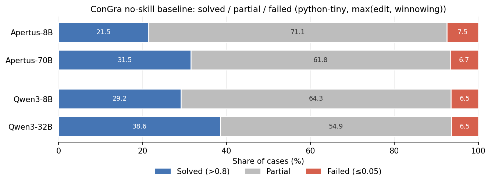

# ConGra baseline — Results (four models, no-skill)

Tracking doc for the ConGra baseline Results prose. Markdown for review/tracking;
the LaTeX block at the end is the copy-paste source for the thesis.

`python-tiny`, no-skill, metric = `max(edit, winnowing)`. ConGra tiering: **solved**
> 0.8, **failed** ≤ 0.05, **partial** in between.

**Data provenance** (matches the gap-closure tables in this folder):
- Apertus-8B: `pilot_results_apertus_baseline_python_tiny.jsonl`
- Apertus-70B: `apertus-70b_baseline_python_tiny.jsonl`
- Qwen3-8B: `pilot_results_qwen3_baseline_python_tiny.jsonl`
- Qwen3-32B: `pilot_results_qwen3-32b_baseline_python_tiny_rtx.jsonl` — the same-env
  **RTX** run (#87 swap). ⚠️ The per-bucket violins may be built from
  `..._32b.jsonl` instead, which gives 38.4% (n=3557) vs the RTX 38.6% (n=3575).
  Use one file consistently across the section.

Reproduce the overview: `python scripts/plot_congra_baseline_overview.py`.

## Figure 1 — 4-model overview



| Model | Solved | Partial | Failed | n |
|---|---:|---:|---:|---:|
| Apertus-8B | 21.5% | 71.1% | 7.5% | 3572 |
| Apertus-70B | 31.5% | 61.8% | 6.7% | 3572 |
| Qwen3-8B | 29.2% | 64.3% | 6.5% | 3574 |
| Qwen3-32B | 38.6% | 54.9% | 6.5% | 3575 |

## Figure 2 — per-bucket violins

Two subfigures (`baseline_violin_scaling_apertus_perBucket.pdf`,
`..._qwen3_...`): distribution of `max(edit, winnowing)` per complexity bucket,
small vs large model, median line in dark red.

## Prose (Results — facts only)

Figure 1 summarises the no-skill ConGra baselines for all four models. Solved rate
rises with model size within each family: Apertus 21.5% → 31.5% (8B → 70B) and
Qwen3 29.2% → 38.6% (8B → 32B). Failure rates are low and nearly size-invariant
(Apertus 7.5% / 6.7%, Qwen3 6.5% / 6.5%), so the gain comes almost entirely from
partial cases becoming solved (Apertus partial 71.1% → 61.8%, Qwen3 64.3% →
54.9%). Mean similarity also rises with size on both metrics (Apertus +0.09 edit,
+0.08 winnowing; Qwen3 +0.07 edit, +0.06 winnowing), consistent across the two
measures.

Figure 2 breaks the baseline down by conflict-complexity bucket. In both families
the larger model raises the median and the solved rate in every one of the seven
buckets. Bucket sizes range from n = 81 (`text+sytx`) to ~896 (`text+sytx+func`).

For Apertus, the largest solved-rate gain is +17.3 pp in `text+sytx` and the
smallest +2.3 pp in `sytx+func`; only `text+sytx+func` clears a 50% solved rate
(51.5%), and it is the one bucket where the 70B median crosses 0.8. Failure rates
are similar across buckets, apart from a ~3 pp drop in `sytx+func` (7.0% → 3.9%)
and a slight rise in `text+sytx` (3.7% → 4.9%). In `text+sytx+func` both models are
bimodal, with cases massed near 0 and 1.

For Qwen3, the largest solved-rate gain is +13.6 pp in `text+func`;
`text+sytx+func` has both the highest failure rate (~13%) and the highest solved
rate (50.1% → 55.3%), while `func`, `sytx` and `sytx+func` are the weakest (11–15%
solved at 8B). Family failure rates stay roughly flat across buckets.

## LaTeX source

```latex
\section{Merge Conflict Resolution: ConGra Benchmark Results}
\label{sec:congra_results}

This section presents the evaluation results for each model on the three
SWE-task benchmarks, with and without \texttt{SKILL.md}.

Figure~\ref{fig:congra_baseline_overview} summarises the no-skill ConGra
baselines for all four models on the \texttt{python-tiny} subset. Following
ConGra, a case counts as \emph{solved} at a per-case
$\max(\mathrm{edit},\mathrm{winnowing}) > 0.8$ and \emph{failed} at
$\leq 0.05$, with the remainder \emph{partial}. Solved rate rises with model
size within each family: Apertus $21.5\%\rightarrow31.5\%$ (8B$\rightarrow$70B)
and Qwen3 $29.2\%\rightarrow38.6\%$ (8B$\rightarrow$32B). Failure rates are low
and nearly size-invariant (Apertus $7.5\%/6.7\%$, Qwen3 $6.5\%/6.5\%$), so the
gain comes almost entirely from partial cases becoming solved. Mean similarity
also rises with size on both metrics (Apertus $+0.09$ edit, $+0.08$ winnowing;
Qwen3 $+0.07$ edit, $+0.06$ winnowing), consistent across the two measures.

Figures~\ref{fig:congra_apertus_perbucket} and~\ref{fig:congra_qwen3_perbucket}
break the baseline down by conflict-complexity bucket, plotting the
distribution of $\max(\mathrm{edit},\mathrm{winnowing})$ with the median (dark
red line). In both families the larger model raises the median and the solved
rate in every one of the seven buckets. Bucket sizes range from $n=81$
(\texttt{text+sytx}) to ${\sim}896$ (\texttt{text+sytx+func}).

For Apertus, the largest solved-rate gain is $+17.3$~pp in \texttt{text+sytx}
and the smallest $+2.3$~pp in \texttt{sytx+func}; only \texttt{text+sytx+func}
clears a $50\%$ solved rate ($51.5\%$), and it is the one bucket where the 70B
median crosses $0.8$. Failure rates are similar across buckets, apart from a
${\sim}3$~pp drop in \texttt{sytx+func} ($7.0\%\rightarrow3.9\%$) and a slight
rise in \texttt{text+sytx} ($3.7\%\rightarrow4.9\%$). In \texttt{text+sytx+func}
both models are bimodal, with cases massed near $0$ and $1$.

For Qwen3, the largest solved-rate gain is $+13.6$~pp in \texttt{text+func};
\texttt{text+sytx+func} has both the highest failure rate (${\sim}13\%$) and the
highest solved rate ($50.1\%\rightarrow55.3\%$), while \texttt{func},
\texttt{sytx} and \texttt{sytx+func} are the weakest ($11$--$15\%$ solved at
8B). Family failure rates stay roughly flat across buckets.

\begin{figure}[t!]
    \centering
    \includegraphics[width=0.95\textwidth]{figures/congra_baseline_overview.pdf}
    \caption{No-skill ConGra baselines for all four models on \texttt{python-tiny}:
             solved / partial / failed rates.}
    \label{fig:congra_baseline_overview}
\end{figure}

\begin{figure}[t!]
    \centering
    \begin{subfigure}{0.95\textwidth}
        \centering
        \includegraphics[width=\textwidth]{figures/baseline_violin_scaling_apertus_perBucket.pdf}
        \caption{Apertus family (8B vs.\ 70B), solved rate by complexity bucket.}
        \label{fig:congra_apertus_perbucket}
    \end{subfigure}
    \vspace{1em}
    \begin{subfigure}{0.95\textwidth}
        \centering
        \includegraphics[width=\textwidth]{figures/baseline_violin_scaling_qwen3_perBucket.pdf}
        \caption{Qwen3 family (8B vs.\ 32B), solved rate by complexity bucket.}
        \label{fig:congra_qwen3_perbucket}
    \end{subfigure}
    \caption{No-skill ConGra baseline by conflict-complexity bucket.}
\end{figure}
```

## Open checks (before finalising)

- Mean-similarity deltas computed from source: Apertus +0.086 edit / +0.082 winn,
  Qwen3 +0.070 edit / +0.062 winn (absolute, 0–1 scale). Raw means: Apertus
  0.384/0.493 → 0.470/0.575; Qwen3 0.452/0.559 → 0.522/0.622.
- `text+sytx+func` failure rate stated as ~13% — confirm the exact per-model figures.
- Bucket n range (81 … ~896) — confirm the upper bound.
