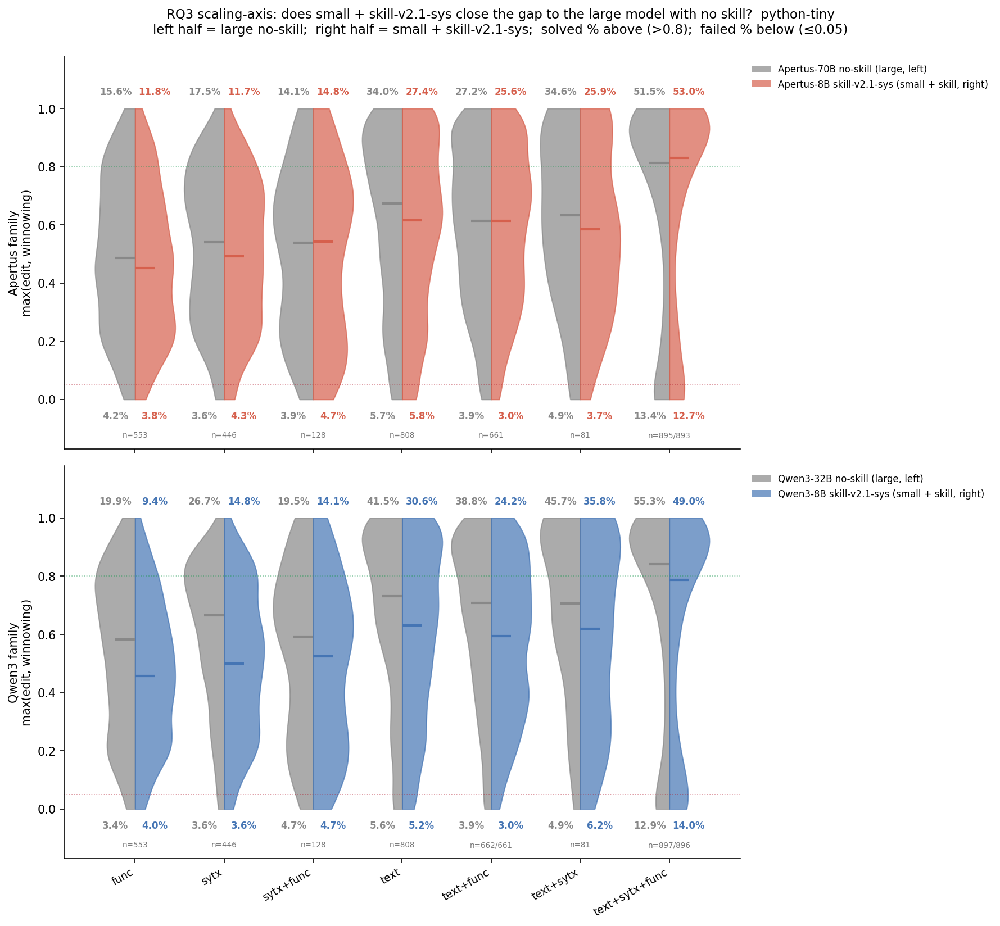

# Gap-closure / skill effect — Results (RQ3)

Tracking doc for the RQ3 Results prose (does a small model + skill-v2.1 close the
gap to a larger model?). Markdown for review; the LaTeX block at the end is the
copy-paste source. All numbers verified from source.

`python-tiny`, metric = `max(edit, winnowing)`, skill = `skill-v2.1-sys`. Solved
> 0.8, failed ≤ 0.05. Baselines match the gap-closure tables in this folder
(Qwen3-32B = `_rtx` run).

**Main figure:** `rq3_scaling_gap_closure_v2.1_max.png` — split violins, per
bucket. **Top panel** = Apertus (grey = 70B no-skill, red = 8B skill-v2.1-sys);
**bottom panel** = Qwen3 (grey = 32B no-skill, blue = 8B skill-v2.1-sys). Median
= horizontal line.



## Aggregate skill effect (solved rate)

| Model | Baseline | +skill | Δ (pp) |
|---|--:|--:|--:|
| Apertus-8B | 21.47 | 28.57 | **+7.10** |
| Qwen3-8B | 29.16 | 28.30 | −0.86 |
| Apertus-70B | 31.52 | 28.82 | −2.70 |
| Qwen3-32B | 38.57 | 37.98 | −0.59 |

## Per-bucket medians

Apertus-8B + skill vs Apertus-70B baseline:

| Bucket | 8B+skill | 70B | Δ |
|---|--:|--:|--:|
| func | 0.45 | 0.49 | −0.04 |
| sytx | 0.49 | 0.54 | −0.05 |
| sytx+func | 0.54 | 0.54 | +0.01 |
| text | 0.62 | 0.67 | −0.06 |
| text+func | 0.61 | 0.61 | 0.00 |
| text+sytx | 0.59 | 0.63 | −0.05 |
| text+sytx+func | 0.83 | 0.81 | +0.02 |

Qwen3-8B + skill vs Qwen3-32B baseline:

| Bucket | 8B+skill | 32B | Δ |
|---|--:|--:|--:|
| func | 0.46 | 0.58 | −0.13 |
| sytx | 0.50 | 0.67 | −0.17 |
| sytx+func | 0.52 | 0.59 | −0.07 |
| text | 0.63 | 0.73 | −0.10 |
| text+func | 0.60 | 0.71 | −0.11 |
| text+sytx | 0.62 | 0.71 | −0.09 |
| text+sytx+func | 0.79 | 0.84 | −0.05 |

## Prose (Results — facts only)

To examine whether a small 8B model can close the performance gap to a larger
model, we compare, within each family, the 8B model with the skill-v2.1 SKILL.md
in its system prompt against the larger model's no-skill baseline (Figure 4.2).

Apertus-8B improves its solved rate by 7.1 pp with the skill-v2.1 SKILL.md in its
system prompt. All other models solve fewer cases with the skill: Qwen3-8B loses
0.86 pp, Apertus-70B 2.7 pp and Qwen3-32B 0.59 pp.

To assess whether the skill's effect varies across complexity buckets,
Table~\ref{tab:apertus_gap_closure} shows the Apertus family, where the 8B model
with skill-v2.1 reaches or exceeds the Apertus-70B no-skill baseline in two of
seven buckets: `sytx+func` (14.8 vs. 14.1) and `text+sytx+func` (53.0 vs. 51.5),
and recovers between 40% and 79% of the gap in the other five (smallest closure in
`text`, 40%; largest in `text+func`, 79%).

In Figure 4.2 (Apertus panel), the Apertus-8B median with the v2.1 skill reaches
or exceeds the 70B baseline in several buckets (e.g. `text+func` 0.61 vs. 0.61,
`text+sytx+func` 0.83 vs. 0.81).

When comparing the Qwen3-32B no-skill baseline to Qwen3-8B with the skill-v2.1
SKILL.md (Figure 4.2, Qwen3 panel), the median is consistently lower for the small
8B model than for the 32B — in every one of the seven buckets.

## LaTeX source

```latex
To examine whether a small 8B model can close the performance gap to a larger
model, we compare, within each family, the 8B model with the skill-v2.1
\texttt{SKILL.md} in its system prompt against the larger model's no-skill
baseline (Figure~\ref{fig:rq3_scaling_gap_closure}).

Apertus-8B improves its solved rate by 7.1~pp with the skill-v2.1
\texttt{SKILL.md} in its system prompt. All other models solve fewer cases with
the skill: Qwen3-8B loses 0.86~pp, Apertus-70B 2.7~pp and Qwen3-32B 0.59~pp.

To assess whether the skill's effect varies across complexity buckets,
Table~\ref{tab:apertus_gap_closure} shows the Apertus family, where the 8B model
with skill-v2.1 reaches or exceeds the Apertus-70B no-skill baseline in two of
seven buckets: 'sytx+func' (14.8 vs.\ 14.1) and 'text+sytx+func' (53.0 vs.\ 51.5),
and recovers between 40\% and 79\% of the gap in the other five (smallest closure
in 'text', 40\%; largest in 'text+func', 79\%).

In Figure~\ref{fig:rq3_scaling_gap_closure} (Apertus panel), the Apertus-8B
median with the v2.1 skill reaches or exceeds the 70B baseline in several buckets
(e.g.\ \texttt{text+func} 0.61 vs.\ 0.61, \texttt{text+sytx+func} 0.83 vs.\ 0.81).

When comparing the Qwen3-32B no-skill baseline to Qwen3-8B with the skill-v2.1
\texttt{SKILL.md} (Figure~\ref{fig:rq3_scaling_gap_closure}, Qwen3 panel), the
median is consistently lower for the small 8B model than for the 32B --- in every
one of the seven buckets.
```

## Open items

- **Figure label.** `rq3_scaling_gap_closure_v2.1_max.png` has no `\label` yet;
  pick one (used `fig:rq3_scaling_gap_closure` as placeholder) and set it. The
  figure holds both families — reference "Apertus panel" / "Qwen3 panel".
- **Two different baselines — do not conflate.** Qwen3-8B+skill vs **32B**
  baseline → median consistently lower in all 7 buckets (this doc). Qwen3-8B+skill
  vs **8B** baseline → median lower in only 5/7 (higher in `sytx+func`,
  `text+sytx`). Name the baseline in each sentence.
- `(Figure 4.2)` is a hard number — switch to `\ref` in the thesis.
