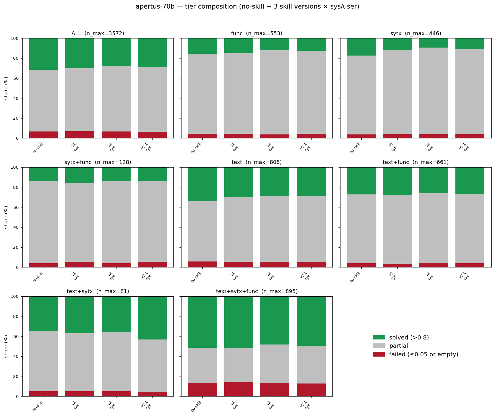
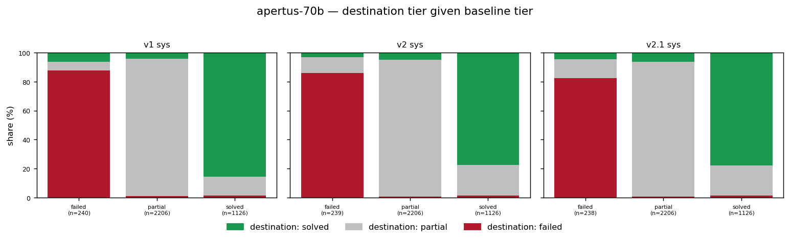
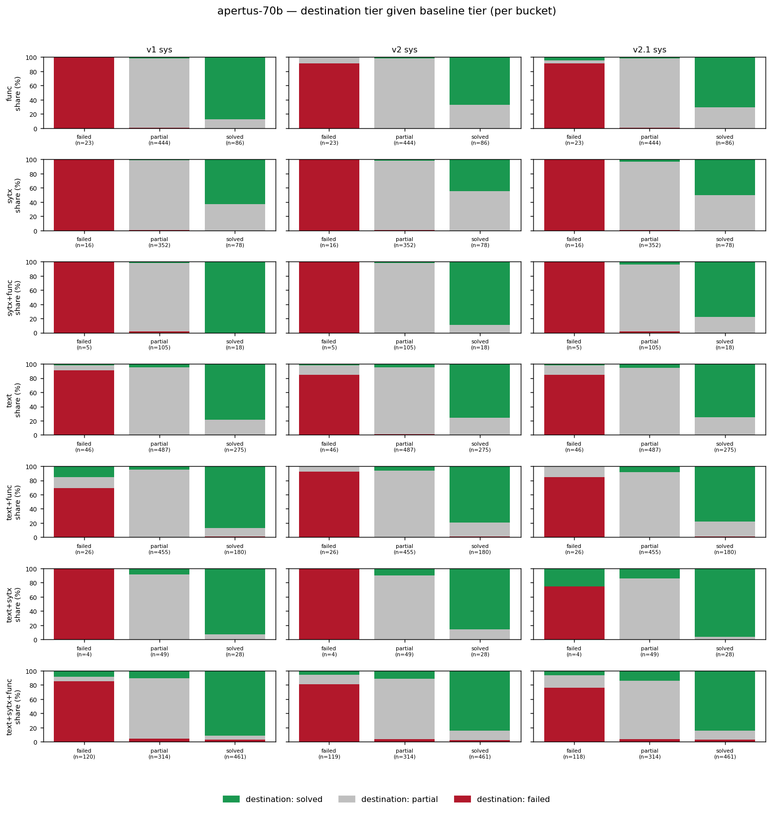

# Apertus-70B performance analysis: no-skill / v1 / v2 / v2.1

Tier-level analysis of Apertus-70B (fp8) across the no-skill baseline plus
v1 / v2 / v2.1 (all `sys` placement — the large pair drops the `user`
condition) on the python-tiny ConGra slice. Part of #86.

Large-pair sibling of `docs/apertus_performance_analysis.md` (8B, #66). The
analysis script `scripts/analyze_pass_fail.py` is reused with
`--model apertus-70b --sys-only`. §6 is the cross-model (vs Qwen3-32B) and §7
the cross-scale (vs 8B) contrast.

**Headline up front:** unlike Apertus-8B — where v2.1-sys was the single
biggest win in the whole study (+7.10pp solved) — **Apertus-70B is harmed by
the skill at every version.** The skill does not transfer to the larger
Apertus model. §7 argues this is consistent with, not contradictory to, the
8B finding, once "baseline strength" is read as *absolute capability*.

## 1. Setup

**Inputs** (all in tree, committed `00d5f99`, #83):

- `scripts/results/apertus-70b_baseline_python_tiny.jsonl`
- `scripts/results/apertus-70b_v1_python_tiny.jsonl`
- `scripts/results/apertus-70b_v2_python_tiny.jsonl`
- `scripts/results/apertus-70b_v2.1_python_tiny.jsonl`

**Tier scheme** unchanged from #56/#62: `solved` if `max(edit, winnowing) > 0.8`;
`failed` if `max(edit, winnowing) ≤ 0.05`; `partial` otherwise. Empty
resolutions fold in at score 0 → `failed`. Error rows excluded.

**Effective n per cell** (after excluding errors): no-skill 3,572; v1 3,572;
v2 3,571; v2.1 3,570. Each file has its own per-version no-skill is *not*
present (sys-only convention) — all skill cells are paired against the single
`apertus-70b_baseline_python_tiny.jsonl`. Unlike the 32B case, **the baseline
and skill runs share the same RTX 6000 serve**, so there is no
cross-environment confound here. ~25–27 context-boundary error rows per file
(HF/vLLM tokenizer mismatch), excluded.

## 2. Overall composition

**Headline (ALL bucket, % of n):**

| condition | solved | partial | failed |
|---|--:|--:|--:|
| no-skill | 31.52% | 61.76% | 6.72% |
| v1 sys | 30.15% | 62.99% | 6.86% |
| v2 sys | 27.81% | 65.56% | 6.64% |
| v2.1 sys | 28.82% | 64.76% | 6.41% |

- **Every version reduces solved-rate.** v1 −1.37pp, v2 −3.71pp, v2.1
  −2.70pp. The ordering is **not monotonic** — v2 is the *worst* version,
  v2.1 recovers slightly but stays well below baseline.
- This inverts the Apertus-8B picture entirely (8B: v1 −2.13, v2 **+4.55**,
  v2.1 **+7.10**). The v2/v2.1 output-discipline content that lifted the 8B
  model *suppresses* solved cases at 70B.
- Failed-rate is essentially flat (6.41–6.86% vs 6.72% baseline). As on
  Qwen3, the movement is on the partial↔solved axis.

## 3. Transitions vs the no-skill baseline

**Headline transitions (ALL bucket, baseline tier counts:
failed≈240, partial≈2,206, solved≈1,126):**

| cell | n_paired | partial→solved | solved→partial | net solved Δ |
|---|--:|--:|--:|--:|
| v1 sys | 3,572 | 97 | 146 | **−49** |
| v2 sys | 3,571 | 113 | 240 | **−133** |
| v2.1 sys | 3,570 | 140 | 234 | **−97** |

(`net solved Δ` = `partial→solved + failed→solved − solved→partial −
solved→failed`.)

- **All three versions flow downward.** Critically, the upward flow
  (partial→solved) actually *grows* with version (97 → 113 → 140) — the skill
  is rescuing more partial cases at v2/v2.1 — but the **downward flow grows
  faster** (146 → 240 → 234). The skill is simultaneously lifting some
  partials and knocking many solved cases down to partial.
- This is the mirror image of Apertus-8B, where v2.1-sys had P→S 312 vs S→P
  75 (4.2:1 *upward*). At 70B the same condition is P→S 140 vs S→P 234
  (1:1.7 *downward*). **Same skill text, opposite asymmetry, driven only by
  the stronger baseline.**
- Failure rescue persists but is small (v2.1: 11 F→S + 31 F→P = 42/238 ≈ 18%
  of baseline-failed pulled up) — comparable to the 8B rate, so the skill
  still helps the genuinely-failing tail; it's the solved→partial regressions
  that dominate the net.

## 4. Per-bucket stratification (RQ2)

**Solved-rate per bucket** (% of bucket n; bold = improves over no-skill):

| bucket | n | no-skill | v1 sys | v2 sys | v2.1 sys |
|---|--:|--:|--:|--:|--:|
| func | 553 | 15.55 | 14.83 | 12.12 | 12.66 |
| sytx | 446 | 17.49 | 11.66 | 9.42 | 11.21 |
| sytx+func | 128 | 14.06 | **15.62** | 14.06 | 14.06 |
| text | 808 | 34.03 | 30.07 | 28.96 | 29.08 |
| text+func | 661 | 27.23 | **27.84** | 26.02 | 26.93 |
| text+sytx | 81 | 34.57 | **37.04** | **35.80** | **43.21** |
| text+sytx+func | 895 | 51.51 | **52.07** | 48.21 | 49.61 |

RQ2 read-out:

- **The skill helps almost no bucket.** The positive cells are sparse and
  mostly tiny-n: `sytx+func` (n=128) v1 +1.6pp; `text+func` v1 +0.6pp;
  `text+sytx+func` v1 +0.6pp; and `text+sytx` (n=81) across all versions, up
  to **v2.1 +8.6pp**.
- **`text+sytx` (n=81) is the one consistent bright spot** — v2.1 +8.6pp
  solved, +0.060 Δedit (the only sizeable positive Δedit in the matrix). But
  at n=81 this is a fragile signal; the same bucket was the strongest
  responder on Apertus-8B too, so it is worth a targeted look, not a headline.
- The biggest damage is on `sytx` (−8.1pp at v2) and `func` (−3.4pp at v2) —
  the short-context buckets, where the skill's framing apparently disrupts an
  already-adequate baseline behaviour.

## 5. Baseline-normalised Δedit summary

**Mean Δedit per bucket** (Δ = skill − no-skill; positive = skill helps):

| bucket | v1 sys | v2 sys | v2.1 sys |
|---|--:|--:|--:|
| func | −0.017 | −0.043 | −0.035 |
| sytx | −0.030 | −0.071 | −0.057 |
| sytx+func | −0.001 | −0.013 | −0.022 |
| text | −0.018 | −0.047 | −0.033 |
| text+func | −0.004 | −0.009 | −0.004 |
| text+sytx | **+0.005** | **+0.017** | **+0.060** |
| text+sytx+func | **+0.000** | −0.018 | −0.009 |
| **ALL** | **−0.011** | **−0.032** | **−0.022** |

- **ALL Δedit is negative at every version, worst at v2** (−0.032), partially
  recovered at v2.1 (−0.022) — the same non-monotone shape as solved-rate.
- `text+sytx` is the only column-spanning positive bucket (peaking +0.060 at
  v2.1). Everywhere else the skill costs edit-similarity.
- Contrast with Apertus-8B, whose ALL Δedit was **+0.043 / +0.061** at
  v2/v2.1. The sign flips entirely with scale.

## 6. Cross-model contrast (vs Qwen3-32B)

Within the large pair, **both models are harmed**, but in different shapes:

| condition | Qwen3-32B Δsolved | Apertus-70B Δsolved | Qwen3-32B Δedit | Apertus-70B Δedit |
|---|--:|--:|--:|--:|
| v1 sys | −3.34 | −1.37 | −0.027 | −0.011 |
| v2 sys | −2.27 | −3.71 | −0.019 | −0.032 |
| v2.1 sys | **−0.59** | −2.70 | −0.006 | −0.022 |

- **Qwen3-32B recovers monotonically toward parity (v2.1 ≈ neutral);
  Apertus-70B does not** (v2 worst, v2.1 still −2.70pp). The clean
  design-iteration story (v1→v2→v2.1 better) holds on Qwen3-32B but breaks on
  Apertus-70B.
- The 8B cross-model contrast was "Apertus helped, Qwen3 not." At the large
  scale that contrast **collapses**: both are harmed, Apertus-70B more so.
  The skill's value did not survive scaling either model up.

## 7. Cross-scale contrast (vs the 8B pair) — absolute-capability framing

**Solved-rate Δ vs own baseline, all four models, sys placement:**

| model | baseline solved% | v1-sys | v2-sys | v2.1-sys |
|---|--:|--:|--:|--:|
| Apertus-8B | 21.47% | −2.13 | +4.55 | **+7.10** |
| Qwen3-8B | 29.16% | −5.60 | +0.00 | −0.86 |
| Apertus-70B | 31.52% | −1.37 | −3.71 | −2.70 |
| Qwen3-32B | 38.57% | −3.34 | −2.27 | −0.59 |

This is the central result of the large-pair analysis:

- **Only the weakest baseline (Apertus-8B, 21.47%) is helped.** All three
  models at or above ~29% solved are neutral-to-harmed by every version.
- **Apertus-70B is the decisive case.** It is the *same model family* as the
  one big win, scaled up — and it lands on the *harmed* side. Its baseline
  (31.52%) sits above the ~29–30% threshold, so it behaves like Qwen3, not
  like Apertus-8B. This rules out a "model family" explanation and points to
  **absolute baseline capability** as the governing variable: the skill helps
  a genuinely weak model and hurts a competent one, regardless of which family
  or size produced that competence.
- Restated finding for the thesis: the 8B "skill direction = baseline
  strength" result generalises as *the SKILL.md's net benefit is negative once
  the model already solves ≳29–30% of python-tiny conflicts unaided; below
  that, the output-discipline content provides real lift (Apertus-8B
  +7.10pp).* The positive RQ1/RQ3 answer is a **small/weak-model phenomenon**,
  not a property of the skill in general.

A mechanistic reading consistent with the 8B analyses
(`docs/analysis_apertus_v1_v2.md`): the v2/v2.1 gains on Apertus-8B came
mostly from **harm-reduction** (curbing over-generation, which the
edit-similarity metric rewards). A more capable model over-generates less, so
there is less harm to reduce — and the skill's prescriptions instead perturb
already-good resolutions downward (the growing solved→partial flow in §3).

## 8. Implications for RQs

- **RQ1 (does the skill improve resolution quality?)** — **No on
  Apertus-70B**, at any version (worst −3.71pp at v2, best −1.37pp at v1).
  Combined with Qwen3-32B (also no), the large-pair verdict on RQ1 is
  uniformly negative.
- **RQ2 (does effect vary by complexity?)** — Yes but unhelpfully: the skill
  hurts short-context buckets most (`sytx` −8.1pp) and helps only `text+sytx`
  (n=81). No robust complexity regime where the skill helps at scale.
- **RQ3 (small/weak + skill vs large/strong no-skill)** — see the #86 RQ3
  gap-closure violins (both within-scale and scaling-axis framings). The §7
  table shows the gap-closing capacity is confined to the weak 8B baseline;
  at 70B the skill widens, not closes, the distance to the no-skill ceiling.
- **Cross-scale headline (the load-bearing result):** the skill's benefit
  depends on absolute baseline capability. It transfers to Apertus-8B (weak)
  and to neither large model nor Qwen3-8B (all ≳29% solved). This reframes the
  thesis's positive result honestly as scale/capability-bounded.

## 9. Pointers

- Script: `scripts/analyze_pass_fail.py --model apertus-70b --sys-only`.
- CSVs: `docs/analysis/apertus-70b_{tier_counts,transitions,delta_edit}.csv`.
- Figures: `docs/figures/apertus-70b_{tier_stacked,transitions,transitions_per_bucket}.png`.
- Qwen3-32B sibling: `docs/qwen3_32b_performance_analysis.md`.
- 8B siblings: `docs/apertus_performance_analysis.md` (#66),
  `docs/qwen3_performance_analysis.md` (#62).
- Data provenance: #75 (generation), #83 (Apertus-70B run), `00d5f99` (commit).
