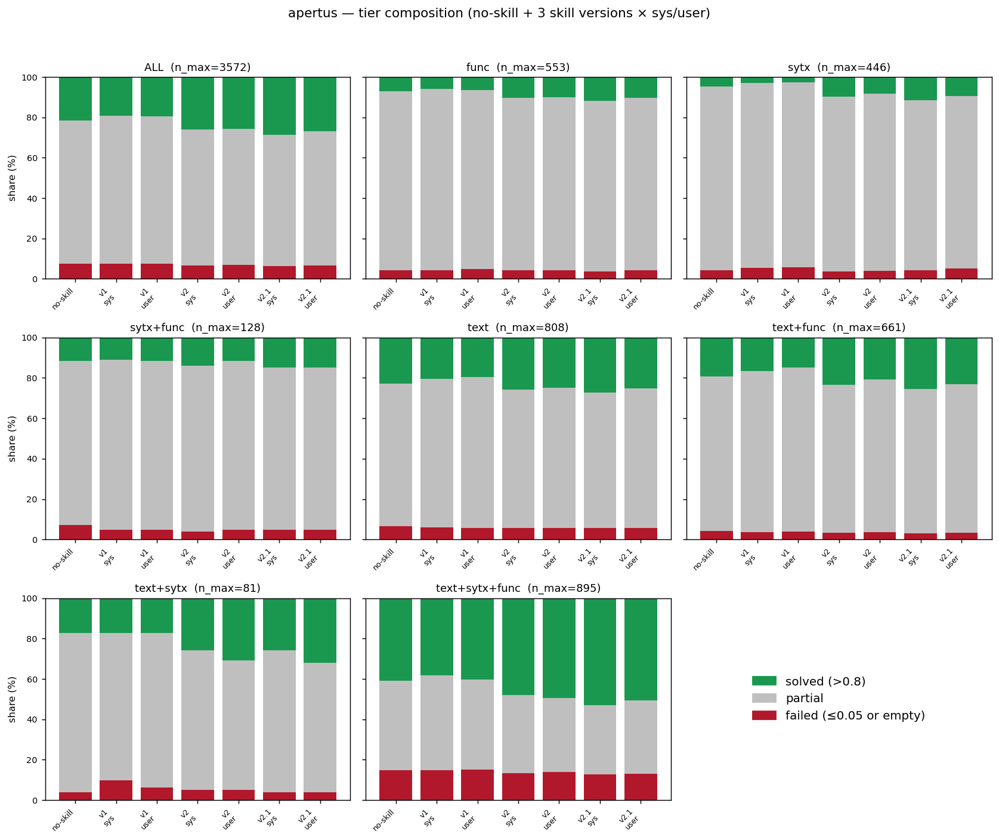
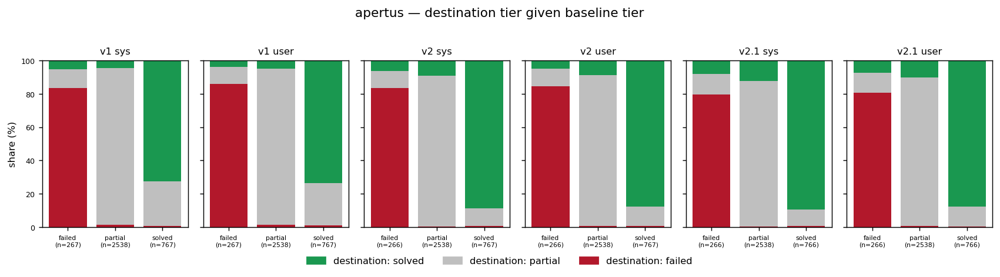
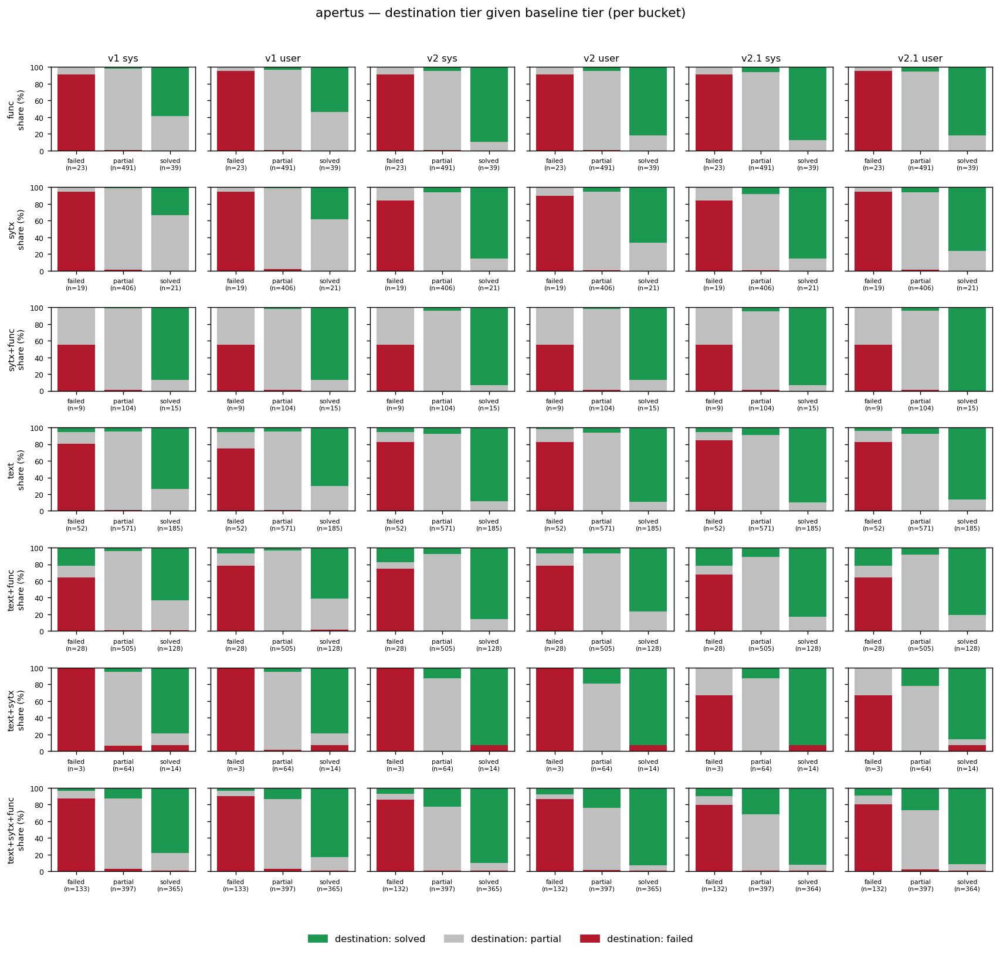

# Apertus-8B performance analysis: no-skill / v1 / v2 / v2.1

Tier-level analysis of Apertus-8B across the 4 skill conditions (no-skill
baseline plus v1 / v2 / v2.1 each in `sys` and `user` placements) on the
python-tiny ConGra slice. Closes #66.

Sibling of `docs/qwen3_performance_analysis.md` (#62). The analysis
script `scripts/analyze_pass_fail.py` is reused verbatim with
`--model apertus`. §6 below is the cross-model contrast block.

## 1. Setup

**Inputs** (all in tree):

- `scripts/results/pilot_results_apertus_baseline_python_tiny.jsonl` (#46)
- `scripts/results/pilot_results_apertus_v1_python_tiny.jsonl` (#57, #58)
- `scripts/results/pilot_results_apertus_v2_python_tiny.jsonl` (#54)
- `scripts/results/pilot_results_apertus_v2.1_python_tiny.jsonl` (#55)

**Tier scheme** unchanged from #56/#62: `solved` if
`max(edit, winnowing) > 0.8`; `failed` if `max(edit, winnowing) ≤ 0.05`;
`partial` otherwise. Empty resolutions fold in at score 0 → `failed`.
Error rows excluded.

**Effective n per cell** (after excluding errors; empties retained as
score 0):

| cell | n |
|---|---|
| no-skill | 3,572 |
| v1 sys / user | 3,572 each |
| v2 sys / user | 3,571 each |
| v2.1 sys / user | 3,570 each |

Apertus v1 was the painful sweep (#57): merged from a 2026-05-18 c=2
partial (clean buckets) plus per-bucket reruns of the three buckets
that crashed every prior attempt (#57/#58). 22 pre-filter skips
distributed across `text+func` (2), `text+sytx+func` (11), plus
context-length / connection errors from the source partial. v2 and v2.1
were single nohup sweeps at c=2 + `--max-prompt-tokens 30720` with zero
errors. n_paired in §3 ≈ 3,570 at ALL (intersection of baseline-scorable
∩ cell-scorable).

## 2. Overall composition

**Headline (ALL bucket, % of n):**

| condition | solved | partial | failed |
|---|--:|--:|--:|
| no-skill | 21.47% | 71.05% | 7.47% |
| v1 sys | 19.34% | 73.27% | 7.39% |
| v1 user | 19.48% | 72.99% | 7.53% |
| v2 sys | **26.02%** | 67.41% | 6.58% |
| v2 user | **25.57%** | 67.57% | 6.86% |
| v2.1 sys | **28.57%** | 65.01% | 6.41% |
| v2.1 user | **26.75%** | 66.61% | 6.64% |

- **v2-sys lifts solved-rate by +4.55pp** (21.47% → 26.02%) and v2-user
  by +4.10pp. ALL Δedit +0.043 / +0.038.
- **v2.1-sys lifts solved-rate by +7.10pp** (21.47% → 28.57%) — bigger
  than v2-sys. ALL Δedit +0.061. The 2026-05-07 v2.1 design prediction
  ("v2.1 should improve over v2 on Apertus") held at full python-tiny.
- v1 hurts modestly (−2.1pp sys, −2.0pp user). Failed rate barely moves
  in either direction — gains and losses are all within the
  partial↔solved axis.

## 3. Transitions vs the no-skill baseline

**Headline transitions (ALL bucket, baseline tier counts:
failed=267, partial=2,538, solved=767):**

| cell | n_paired | partial→solved | solved→partial | net solved Δ |
|---|--:|--:|--:|--:|
| v1 sys | 3,572 | 120 | 204 | **−76** |
| v1 user | 3,572 | 122 | 196 | **−71** |
| v2 sys | 3,571 | 231 | 81 | **+162** |
| v2 user | 3,571 | 227 | 89 | +146 |
| v2.1 sys | 3,570 | **312** | 75 | **+254** |
| v2.1 user | 3,570 | 263 | 91 | +194 |

(`net solved Δ` = `partial→solved + failed→solved − solved→partial −
solved→failed`.)

Three observations:

1. **v2-sys is highly asymmetric upward.** 231 partial→solved lifts vs
   81 solved→partial drops — almost 3× more help than harm. v2-user is
   only marginally less strong (227 / 89). Compare Qwen3 v2-sys: 140 /
   141, near-perfect flux equilibrium. **The same skill text, the same
   pipeline, the same temperature — different model, different effect.**
2. **v2.1-sys is the strongest condition tested.** 312 partial→solved
   (+35% over v2-sys) with the same 75 solved→partial. The skill's
   stronger output-discipline framing translates directly into more
   tier lifts on the weaker baseline.
3. **Failure rescue on Apertus is more substantial than on Qwen3.**
   v2.1-sys recovers 22 of 267 baseline-failed cases to solved and 32 to
   partial — 54/267 = **20% of deep-fail cases pulled out** of the
   failed tier (vs Qwen3 v2.1-sys: 15/233 = 6%). The skill operates on
   failed-tier cases on Apertus, not only on partial / solved tiers.

## 4. Per-bucket stratification (RQ2)

**Solved-rate per (skill, condition) per bucket** (% of bucket n; bold
= improves over no-skill baseline):

| bucket | n | no-skill | v1 sys | v1 user | v2 sys | v2 user | v2.1 sys | v2.1 user |
|---|--:|--:|--:|--:|--:|--:|--:|--:|
| func | 553 | 7.05 | 5.79 | 6.51 | **10.31** | **9.95** | **11.75** | **10.49** |
| sytx | 446 | 4.71 | 2.91 | 2.69 | **9.64** | **8.30** | **11.66** | **9.42** |
| sytx+func | 128 | 11.72 | 10.94 | 11.72 | **14.06** | 11.72 | **14.84** | **14.84** |
| text | 808 | 22.90 | 20.54 | 19.68 | **25.74** | **24.88** | **27.35** | **25.25** |
| text+func | 661 | 19.36 | 16.49 | 14.83 | **23.30** | **20.73** | **25.57** | **23.15** |
| text+sytx | 81 | 17.28 | 17.28 | 17.28 | **25.93** | **30.86** | **25.93** | **32.10** |
| text+sytx+func | 895 | 40.78 | 38.32 | 40.45 | **47.87** | **49.55** | **52.97** | **50.73** |

Pattern (RQ2 read-out):

- **v2 and v2.1 improve every bucket in both placements** (with one
  partial exception: v2-user on `sytx+func` is flat at 11.72%). The
  improvement is monotonic: the harder the bucket (lower baseline
  solved-rate), the larger the absolute gain.
- **`text+sytx` (n=81) is the strongest-response bucket.** Baseline
  17.28% solved; v2-user 30.86% (+13.6pp), v2.1-user 32.10% (+14.8pp).
  Δedit on this bucket reaches +0.11 (v2.1-user) — the largest
  bucket-level Δedit in the matrix.
- **`text+sytx+func` (n=895) — the largest bucket and the most
  polarised — gains +12.2pp under v2.1-sys** (40.78% → 52.97%). This
  contrasts directly with Qwen3, where the same bucket *loses* −1.1pp
  under the same condition.
- **v1 is mostly hurts-or-flat per bucket.** Exception: `text+sytx` is
  perfectly flat (17.28% / 17.28%; 14/81 cases unchanged) and
  `sytx+func` user-placement at 11.72% matches baseline exactly.

The bucket-level monotonicity (lower baseline → larger gain) supports
the harm-reduction-on-over-generation mechanism documented in
`docs/analysis_apertus_v1_v2.md`: Apertus over-generates more on harder
buckets, the skill's output-discipline section curbs that, and the
edit-similarity metric rewards the shorter output.

## 5. Baseline-normalised Δedit summary

**Mean Δedit per (skill, condition, bucket)** (Δ = skill − no-skill;
positive = skill helps):

| bucket | v1 sys | v1 user | v2 sys | v2 user | v2.1 sys | v2.1 user |
|---|--:|--:|--:|--:|--:|--:|
| func | −0.022 | −0.024 | **+0.025** | **+0.014** | **+0.033** | **+0.017** |
| sytx | −0.019 | −0.032 | **+0.052** | **+0.028** | **+0.068** | **+0.038** |
| sytx+func | −0.014 | −0.007 | **+0.023** | **+0.019** | **+0.040** | **+0.029** |
| text | −0.010 | −0.019 | **+0.042** | **+0.035** | **+0.055** | **+0.034** |
| text+func | −0.012 | −0.016 | **+0.037** | **+0.026** | **+0.052** | **+0.040** |
| text+sytx | −0.006 | −0.008 | **+0.068** | **+0.085** | **+0.097** | **+0.112** |
| text+sytx+func | −0.003 | +0.008 | **+0.056** | **+0.067** | **+0.085** | **+0.074** |
| **ALL** | **−0.012** | **−0.013** | **+0.043** | **+0.038** | **+0.061** | **+0.045** |

Three takeaways:

- **v2 and v2.1 are positive on every bucket × placement combination.**
  v2-sys ALL +0.043 — close to v2-user but consistently higher in
  every bucket. v2.1-sys ALL +0.061 is the largest Δedit in the matrix.
- **The n=20 pilot predictions held at full n with magnitude amplified.**
  n=20 pilot: Apertus v2-sys +0.034, v2.1-sys +0.042. n=3,571 actual:
  +0.043, +0.061. Sign and ordering preserved; magnitudes 25–45% larger.
  This is unusual — small-pilot effect sizes typically shrink at full n.
- **v1 is mildly negative across the board.** ALL Δedit −0.012/−0.013;
  per-bucket all negative except `text+sytx+func` user (+0.008,
  noise-level). v1 is not just "less helpful than v2" — it actively
  hurts a weak baseline.

## 6. Cross-model contrast

The two models give qualitatively different verdicts on the skill. The
contrast is sharpest at v2 / v2.1 sys-placement.

**Headline (Apertus vs Qwen3, ALL bucket, solved-rate, pp gap = Apertus − Qwen3):**

| condition | Qwen3 | Apertus | A−Q gap | Q skill Δ | A skill Δ |
|---|--:|--:|--:|--:|--:|
| no-skill | 29.16% | 21.47% | −7.69 | 0 | 0 |
| v1 sys | 23.56% | 19.34% | −4.22 | **−5.60** | −2.13 |
| v1 user | 22.05% | 19.48% | −2.57 | **−7.11** | −1.99 |
| v2 sys | 29.16% | **26.02%** | −3.14 | 0.00 | **+4.55** |
| v2 user | 28.32% | 25.57% | −2.75 | −0.84 | **+4.10** |
| v2.1 sys | 28.30% | **28.57%** | **+0.27** | −0.86 | **+7.10** |
| v2.1 user | 27.23% | 26.75% | −0.48 | −1.93 | **+5.28** |

`Q skill Δ` / `A skill Δ` columns: per-model change vs that model's
own no-skill baseline.

**v2.1-sys is the single condition where Apertus overtakes Qwen3
on solved-rate** (+0.27pp). The baseline gap of −7.69pp is fully closed
by the skill in this one cell — a direct positive read-out for **RQ3**
("does small/weak model + skill close the gap to large/strong model
without skill?"). The answer at the headline level is *yes for Apertus
vs Qwen3 in the sys placement of v2.1*, and very nearly so in v2-sys
(−3.14pp residual gap).

**ALL Δedit (Apertus vs Qwen3):**

| condition | Qwen3 | Apertus | sign agreement |
|---|--:|--:|---|
| v1 sys | −0.048 | −0.012 | both negative |
| v1 user | −0.059 | −0.013 | both negative |
| v2 sys | −0.004 | **+0.043** | opposite |
| v2 user | −0.009 | **+0.038** | opposite |
| v2.1 sys | −0.010 | **+0.061** | opposite |
| v2.1 user | −0.018 | **+0.045** | opposite |

v2 and v2.1 reverse sign across models. v1 is small-negative on both.

**Transition asymmetry side-by-side (ALL, partial→solved : solved→partial):**

| condition | Qwen3 P→S : S→P | Apertus P→S : S→P |
|---|---|---|
| v1 sys | 65 : 261 (1 : 4.0) | 120 : 204 (1 : 1.7) |
| v2 sys | 140 : 141 (1 : 1.0) | 231 : 81 (**2.9 : 1**) |
| v2.1 sys | 124 : 156 (1 : 1.3) | 312 : 75 (**4.2 : 1**) |

Same skill text, opposite ratios. v2-sys is at flux equilibrium on
Qwen3 and at 2.9-to-1 upward flow on Apertus. v2.1-sys further
amplifies the asymmetry on Apertus while slightly worsening it on
Qwen3.

**Per-bucket cross-model contrast on `text+sytx+func`** (the largest
bucket, n_max ≈ 895–906):

| condition | Qwen3 solved% | Apertus solved% | Q Δ vs no-skill | A Δ vs no-skill |
|---|--:|--:|--:|--:|
| no-skill | 50.11% | 40.78% | 0 | 0 |
| v2 sys | 47.21% | **47.87%** | −2.90 | **+7.09** |
| v2.1 sys | 49.00% | **52.97%** | −1.11 | **+12.19** |
| v2.1 user | 49.33% | **50.73%** | −0.78 | **+9.95** |

On the bucket where Qwen3 loses ground under every skill condition,
Apertus gains the most. The harm-reduction mechanism (over-generation
suppression) lands hardest where the baseline tendency to over-generate
is largest — and Apertus over-generates more on the hardest bucket.

### Mechanism read-out

Confirmed by the full-n data:

- The skill's effect direction is determined by **baseline strength**,
  not skill content. The same SKILL.md text helps Apertus and hurts (or
  is neutral to) Qwen3.
- The asymmetric upward flow on Apertus, combined with the modest
  failure-rescue rate (~20% of baseline-failed cases pulled out under
  v2.1-sys), indicates the skill is doing *both* harm-reduction (curbing
  over-generation) and pattern-teaching (rescuing failures). The Qwen3
  side shows harm-reduction barely matters because over-generation is
  rare to begin with, and pattern-teaching barely fires either.
- The cross-model verdict is consistent with the n=20 pilot prediction
  recorded in `docs/pilot_results_v2_1.md`: "v2.1 is more skill applied
  harder; on a model that doesn't need much, more skill = more harm."
  Apertus *needs* the skill; Qwen3 does not.

## 7. Implications for RQs

- **RQ1 ("does the skill improve resolution quality?")** —
  **on Apertus: yes, substantially.** v2 ALL Δedit +0.043 and
  solved-rate +4.55pp; v2.1 ALL Δedit +0.061 and solved-rate +7.10pp.
  Both well above the no-skill ceiling on every bucket. **On Qwen3: no**
  (per #62). The RQ1 answer is therefore *model-dependent*: the skill
  helps weaker models and is at best neutral on stronger ones.
- **RQ2 ("does effect vary by complexity?")** — yes, in two ways.
  (a) On Apertus, gains are monotonic in baseline difficulty: hardest
  bucket (`text+sytx+func` baseline 40.78%) gains the most (+12.2pp
  under v2.1-sys). (b) On Qwen3, the same bucket *loses* ground, so the
  same skill flips bucket-direction across models. Per-bucket effect
  sizes are large enough on Apertus (+9pp to +14pp on three buckets) to
  warrant their own per-bucket discussion in the thesis Results
  chapter, not just an ALL aggregate.
- **RQ3 ("does small/weak + skill close the gap to large/strong without
  skill?")** — **yes, for Apertus vs Qwen3, in v2.1-sys**. Apertus baseline
  21.47% solved trails Qwen3 baseline 29.16% by 7.69pp; Apertus v2.1-sys
  closes the gap to +0.27pp (Apertus *overtakes*). v2-sys closes it to a
  3.14pp residual. RQ3 is positively answered at the python-tiny scale
  for the 8B pair; the cluster-scale Qwen3-32B / Apertus-70B comparison
  (#10) remains future work.
- **#43 keep/iterate v2.1 decision now closed on both models.** Qwen3:
  v2.1 ≤ v2. Apertus: v2.1 > v2 (sys +2.55pp solved, user +1.18pp
  solved). The two readings together favour **keeping v2.1 as the
  current best skill version** — the cross-model average +3.04pp at sys
  placement (mean of Apertus +7.10 and Qwen3 −0.86) is net positive, and
  v2.1 is the version with the documented stronger output-discipline
  rules. v3 (#7) remains deferred.

## 8. Pointers

- Script: `scripts/analyze_pass_fail.py` — invoked as
  `--model apertus` with the four `--baseline / --v1 / --v2 / --v2.1`
  Apertus paths.
- CSVs: `docs/analysis/apertus_{tier_counts,transitions,delta_edit}.csv`.
- Figures: `docs/figures/apertus_{tier_stacked,transitions,transitions_per_bucket}.png`.
- Sibling write-up (Qwen3): `docs/qwen3_performance_analysis.md` (#62).
- Tier framework source: `docs/baseline_pass_fail_analysis.md` (#56).
