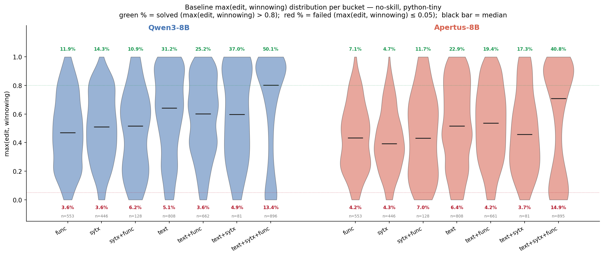
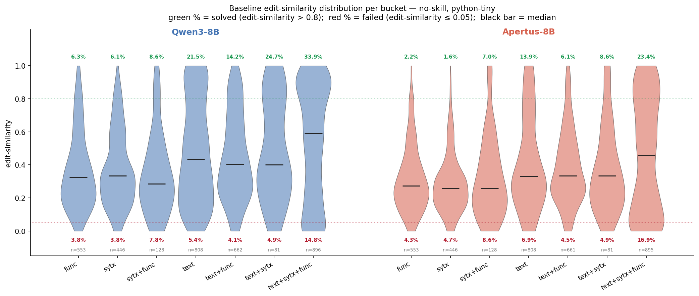
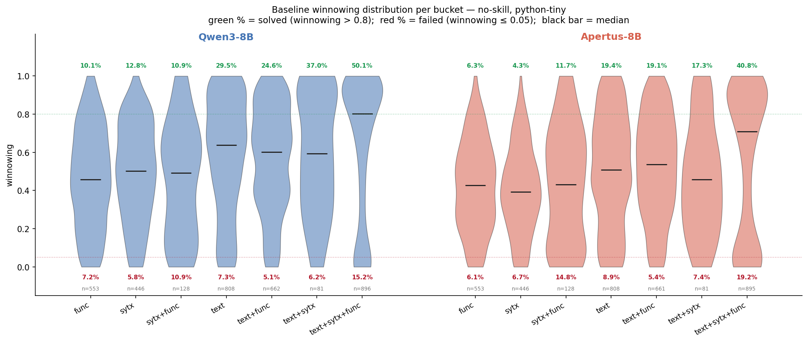
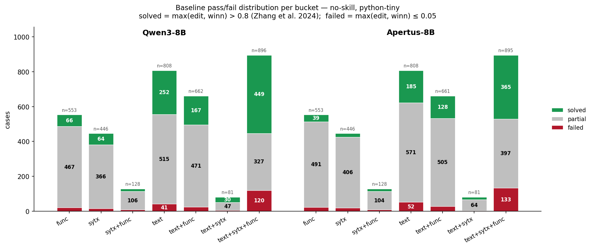
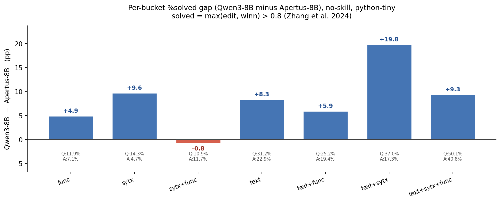

# Baseline pass/fail analysis (no-skill, python-tiny)

Per-bucket characterisation of the no-skill baseline ceiling for Qwen3-8B and
Apertus-8B on the python-tiny ConGra slice. Closes deliverables for issue #56.

## 1. Summary

This analysis characterises the no-skill baseline of Qwen3-8B and Apertus-8B
on the python-tiny ConGra slice (n=3,597 per model, all 7 complexity buckets)
using a pass/fail framing aligned with the ConGra paper's correctness
convention: a resolution is **solved** when
`max(edit-similarity, winnowing-similarity) > 0.8` (at least one of the two
metrics computed in this pipeline exceeds 80%, per Zhang et al. 2024). Note
that the paper's full convention is over three metrics (edit, winnowing,
semantic similarity); our pipeline does not compute semantic similarity, so
our "solved" set is a strict subset of the paper's. We add a second tier,
**failed** = `max(edit, winnowing) ≤ 0.05`, anchored on a natural cliff in
the score distributions and intended to flag near-empty or completely
off-target resolutions; rows where the model returned an empty resolution for
a non-empty ground truth are folded into "failed" at score 0. Everything else
is **partial**. Headline findings: Qwen3-8B solves 29.2% of cases overall
(6.5% deep-fail); Apertus-8B solves 21.5% (7.5% deep-fail). Both models show
the same per-bucket ordering — `text+sytx+func` is the highest-yield bucket
(50.1% / 40.8% solved), `sytx` and `sytx+func` the lowest. Apertus trails
Qwen3 on solved rate in 6 of 7 buckets, with per-bucket gaps ranging from
−0.8 to +19.8 pp (median +8.3 pp; see §6 and `baseline_solved_gap.png` for
the full per-bucket gap chart); failed rates are nearly identical across
both models (max gap 1.5 pp) — so Apertus's weakness is not "model crashes
more often" but "more cases stay in the partial middle that Qwen3 lifts
above 0.8." These observations frame how the skill-effect comparisons
from #53/#54/#55 should be read: pass/fail movement (whether a skill lifts a
partial case across the 0.8 threshold), not just mean shifts.

## 2. Data

The analysis uses two JSONL files produced by the no-skill baseline runs of
#46:

- `scripts/results/pilot_results_qwen3_baseline_python_tiny.jsonl`
  (Qwen3-8B, 3,597 rows)
- `scripts/results/pilot_results_apertus_baseline_python_tiny.jsonl`
  (Apertus-8B, 3,597 rows)

Each row is one case × the no-skill condition. Cases span all 7 complexity
buckets of the python-tiny ConGra slice: `func` (553), `sytx` (446),
`sytx+func` (128), `text` (820), `text+func` (663), `text+sytx` (81),
`text+sytx+func` (906). Per-bucket counts are identical across the two models
(same dataset slice). These are the raw bucket sizes; the tables in §5 and
Appendix A report per-bucket counts after subtracting the error rows
itemised below.

**Error rows** (`error != None`) are excluded. They come from HTTP 400
"maximum context length" errors — the conflict-context prompt exceeded the
model's 32K-token window — plus one transient connection error on Qwen3.
Qwen3-8B: 23 rows (22 context-length, 1 connection). Apertus-8B: 25 rows
(all context-length). These are pipeline failures, not model failures, and
are not part of the resolution-quality population. (Note: prior commit
messages and notes on #46 described these as "OOM" — that label was wrong;
the actual error in both runs is HTTP 400 context-length-exceeded.)

**Empty resolutions** (`metrics.empty=True`; `pilot.py:229–230` returns
`edit=None, winnowing=None` when the model produced no output for a non-empty
ground truth) are real model failures: the model gave up. We fold these in
with score=0 and count them as **failed**. Qwen3-8B: 64 rows. Apertus-8B:
84 rows.

After excluding the 23/25 error rows and folding in the 64/84 empty rows:
**3,574 scorable rows on Qwen3-8B; 3,572 on Apertus-8B.** All subsequent
counts and percentages are over this set.

## 3. Distribution shape

**Score distributions.** The figure below
(`docs/figures/baseline_violin_max.png`, combined max score — the basis for
tiering) shows the per-bucket score distributions as violins; per-metric
violins for edit and winnowing are shown further below. The shape repeats
across both models: a continuous bulk between roughly 0.2 and 0.9, with
two small but identifiable clusters at the extremes — a byte-identical
mode at score = 1.0 (2–7% of cases per bucket, concentrated in
text-containing buckets) and a deep-fail mode at score ≤ 0.05 (3–15% per
bucket, dominated by `text+sytx+func`). Between these endpoints the
distribution is smooth: there is no natural mid-range cliff at 0.8, 0.5, or
anywhere else, so the 0.8 cutoff used for "solved" is anchored on the ConGra
paper's published convention rather than on a feature of our data.

The per-metric distributions show the same shape but with winnowing shifted
upward relative to edit (medians roughly 0.1–0.2 higher per bucket):

**Bimodality in the compound bucket.** `text+sytx+func` has a notably wide
interquartile range on both models (Qwen3 IQR 0.33–0.95, Apertus 0.16–0.90)
and a median far above the mean — the hallmark of a bimodal distribution
with mass at both extremes. This bucket simultaneously has the highest
solved rate (50.1% / 40.8%) and the highest deep-fail rate (13.4% / 14.9%)
of any bucket. The compound text+sytx+func conflicts evidently split sharply
into "the model picks the right side cleanly" and "the model emits something
almost unrelated to the ground truth," with relatively few cases landing in
the middle.

**Inter-metric agreement.** Across the full non-error set, Pearson
r(edit, winnowing) is 0.902 (Qwen3) / 0.905 (Apertus). The two metrics rank
cases largely the same way, but winnowing is systematically more generous
in absolute value (medians per bucket roughly 0.1–0.2 higher than edit).
This is why the OR-combination in the paper convention matters: a meaningful
fraction of cases that don't clear `edit > 0.8` are pulled into the "solved"
set by `winnowing > 0.8`.

Full per-bucket statistics over the combined `max(edit, winnowing)` score
(mean, median, Q25, Q75, %=1.0, %>0.8, %≤0.05) are tabulated in Appendix A.

## 4. Threshold rationale

Issue #56 required thresholds to be derived from the data, not pre-committed
before inspecting the distributions. The procedure was: (1) compute the
score distributions per bucket and per metric (§3); (2) identify natural
cliffs; (3) decide a tier scheme that is either anchored on a cliff or,
where it is not, on an external convention with a citable source. The
outcome is a 3-tier scheme — **solved**, **partial**, **failed** — with the
two thresholds chosen on different bases.

**Solved: `max(edit, winnowing) > 0.8`.** The choice of 0.8 is *not*
anchored on a cliff in our data. The distributions in §3 are smooth across
the entire (0, 1) interval, with the only high-end cliff at exactly 1.0
(byte-identical resolutions). Anchoring "solved" at 1.0 would be the
strictest data-driven choice; we considered it and rejected it because it
discards substantial information about resolutions that are correct but not
byte-identical. Instead we adopt the ConGra paper's published correctness
convention (Zhang et al. 2024): *"For a generated resolution, ConGra regards
the resolution matches the ground truth when at least one of the above
values greater than 80%."* This anchors our tiering on the literature
standard, which makes our pass/fail counts directly comparable to results
that already use this benchmark. Two caveats apply. First, the paper defines
the convention over three similarity metrics (edit, winnowing,
**semantic**); our pipeline does not compute semantic similarity (defined
in `metrics.py` but not invoked by `main.py`), so our
`max(edit, winnowing) > 0.8` is a strict subset of the paper's definition —
a resolution we mark as "partial" might be marked "solved" under the full
3-metric convention if its semantic similarity exceeded 0.8. Second, the
paper specifies strictly greater than (`> 0.8`), not ≥; our local
`smoke_test.py` uses `>= 0.8`, but for this analysis we use the paper's
strict-greater form. Differences in practice are negligible (no scorable
rows land at exactly 0.8) but the formulation should match the paper.

**Failed: `max(edit, winnowing) ≤ 0.05`.** The 0.05 cutoff is
*data-anchored*. The violins in §3 show a clear left-mode at the bottom
of both score distributions — empty resolutions sit at 0.0, and the
next-lowest cases concentrate just above 0. Above ~0.05 the distribution
becomes smooth. The cliff is sharpest on winnowing (the 0.00–0.05 bin holds
7–8% of cases, dropping to 3–4% in the next bin) and gentler on edit. We
use the cliff on the combined max metric, which inherits the lower of the
two cliffs. This tier captures the genuine model-failure mode: empty
resolutions, completely off-target output, and one-token guesses like
`pass`. The paper does not define an analogous "fail" tier; the addition is
ours.

**Partial: everything in between.** The middle band
`0.05 < max(edit, winn) ≤ 0.8` contains the bulk of cases (overall 64.3%
Qwen3, 71.1% Apertus). Inside this band the distributions are smooth —
there is no further natural cut at 0.5, 0.6, or any other value.
Subdividing partial into e.g. "strong" (≥ 0.6) and "weak" (< 0.6) is
possible but would invent thresholds that do not appear in either the data
or the literature; we keep partial as a single band and rely on the
underlying continuous distribution (visible in the violin figures) for
finer-grained comparison.

**Why not per-metric tiering.** An obvious alternative is to compute
separate solved/partial/failed counts for edit and for winnowing, rather
than combining them. We rejected this because (a) the paper convention is
explicitly OR-combined, so per-metric tiers do not match the published
frame; (b) r ≈ 0.90 between the metrics makes per-metric counts highly
redundant — the metrics rank cases the same way 90% of the time; and (c)
reporting two parallel tier-tables would more than double the surface area
of the writeup without adding signal that is not already visible in the
violin figures.

## 5. Per-bucket pass/fail tables

The figure below (`docs/figures/baseline_pass_fail.png`) shows the
per-bucket tier counts as stacked bars (7 Qwen3 left, 7 Apertus right);
the tables that follow give the underlying numbers.

### Qwen3-8B (n=3,574)

| bucket | n | failed | partial | solved | %solved | %failed |
|---|---:|---:|---:|---:|---:|---:|
| func           | 553 |  20 | 467 |  66 | 11.9% | 3.6% |
| sytx           | 446 |  16 | 366 |  64 | 14.3% | 3.6% |
| sytx+func      | 128 |   8 | 106 |  14 | 10.9% | 6.2% |
| text           | 808 |  41 | 515 | 252 | 31.2% | 5.1% |
| text+func      | 662 |  24 | 471 | 167 | 25.2% | 3.6% |
| text+sytx      |  81 |   4 |  47 |  30 | 37.0% | 4.9% |
| text+sytx+func | 896 | 120 | 327 | 449 | 50.1% | 13.4% |
| **OVERALL**    | **3574** | **233** | **2299** | **1042** | **29.2%** | **6.5%** |

### Apertus-8B (n=3,572)

| bucket | n | failed | partial | solved | %solved | %failed |
|---|---:|---:|---:|---:|---:|---:|
| func           | 553 |  23 | 491 |  39 |  7.1% | 4.2% |
| sytx           | 446 |  19 | 406 |  21 |  4.7% | 4.3% |
| sytx+func      | 128 |   9 | 104 |  15 | 11.7% | 7.0% |
| text           | 808 |  52 | 571 | 185 | 22.9% | 6.4% |
| text+func      | 661 |  28 | 505 | 128 | 19.4% | 4.2% |
| text+sytx      |  81 |   3 |  64 |  14 | 17.3% | 3.7% |
| text+sytx+func | 895 | 133 | 397 | 365 | 40.8% | 14.9% |
| **OVERALL**    | **3572** | **267** | **2538** | **767** | **21.5%** | **7.5%** |

**Bucket ordering by %solved.** Both models agree on the extremes but not
on the middle. `text+sytx+func` is highest on both (50.1% / 40.8%) and the
no-text buckets — `func`, `sytx`, `sytx+func` — are clustered at the bottom
on both (Qwen3 10.9–14.3%, Apertus 4.7–11.7%). The ordering inside the
text-heavy group differs:

- Qwen3:   `text+sytx+func` > `text+sytx` > `text` > `text+func`
  (50.1% > 37.0% > 31.2% > 25.2%)
- Apertus: `text+sytx+func` > `text` > `text+func` > `text+sytx`
  (40.8% > 22.9% > 19.4% > 17.3%)

`text+sytx` is Qwen3's second-best bucket but Apertus's fourth-best — the
single biggest per-bucket model divergence in this dataset (see "Cross-model
gap" in §6).

A coarse two-group summary holds across both models: every bucket whose
name contains `text` lands at or above 17% solved; every bucket without
`text` lands below 15%. Text-content presence is the strongest single
per-bucket predictor of solved rate.

**Bucket ordering by %failed.** `text+sytx+func` is the clear deep-fail
leader (13.4% / 14.9%); everywhere else sits in a tight 3–7% band with no
strong ordering between buckets and no clear correspondence to %solved
(e.g. `text+sytx`, which has high solved, has low failed; `sytx+func`,
with low solved, has middling failed).

## 6. Per-bucket interpretation

The tier counts in §5 are not just a baseline snapshot — they map out where
a skill could plausibly move the needle. For each bucket we ask: how much
of the population is potentially liftable into "solved," and how much is
essentially stuck?

**High-headroom buckets (text-heavy, low-failure).** `text`, `text+func`,
and `text+sytx` all have solved rates in the 17–37% range with deep-fail
rates below 7%. The bulk of cases sit in the partial middle: 515/808
(`text`, Qwen3), 471/662 (`text+func`, Qwen3), and similar on Apertus.
These are the buckets where a skill has the most population to work on.
Many partial cases here are not catastrophically wrong — they are likely
close to 0.8 already and a small lift (better over-generation control,
cleaner code-only output) can plausibly push them across the threshold.
Both models show the same headroom pattern, but Apertus has substantially
more headroom in absolute terms because it starts 5–10 pp lower.

**Saturating bucket: `text+sytx+func`.** Half of Qwen3's cases and 41% of
Apertus's are already solved at baseline. Yet 13–15% are deep-fail. The
bimodality from §3 says these cases split sharply at baseline: the model
either picks a side cleanly (solved) or emits nearly-empty / off-target
output (failed). The middle pool that a skill could lift is 327 (Qwen3) /
397 (Apertus), which is small relative to bucket size but still substantial
in absolute terms. The interesting question for this bucket is asymmetric:
a skill that reduces the deep-fail mass (converts failed→partial→solved)
would have outsized impact, but a skill that only nudges partials over 0.8
would show smaller relative gains here than in the headroom buckets.

**Floor buckets (syntax/functional, no text).** `sytx`, `func`, and
`sytx+func` solve at 5–14% on both models — the lowest solved rates
anywhere. Deep-fail rates are also low (3–7%), so these buckets are
dominated by partial cases (366–491 partial per bucket on Qwen3 and
Apertus). Two readings are possible. (a) These cases are intrinsically
harder — they require more than a textual pick because the conflict is
over executable code (syntax structure or function-level semantics) where
one-side-wins resolutions are less often correct. A skill that mostly
trains pick-vs-combine behavior may have limited impact. (b) Alternatively,
the partial pool here may be uniformly "close-but-not-quite" and a small
lift could move a meaningful chunk above 0.8 — same mechanism as the
text-heavy buckets, just from a lower start. Which reading is right is
exactly what the v1/v2/v2.1 comparisons in #53/#54/#55 will resolve.

**Cross-model pattern.** Apertus is below Qwen3 on solved rates in 6 of 7
buckets, but the gap is not uniform — it ranges from −0.8 pp (`sytx+func`,
the one bucket where Apertus is slightly ahead) to +19.8 pp (`text+sytx`,
the largest divergence). Failed rates, by contrast, match closely across
both models (per-bucket gap ≤ 1.5 pp anywhere). The figure below visualises
the per-bucket solved-rate gap; raw per-model numbers are annotated under
each bar.

The deficit is concentrated in the partial-to-solved transition, not in
deep failures. Several readings are consistent with this
pattern — for example, Apertus producing resolutions that score in the
partial band but rarely cross 0.8, or Apertus being systematically more
verbose or conservative in ways the similarity metrics penalize at the
high end. We do not commit to a specific mechanism from baseline data
alone; the skill-effect comparisons in #53/#54/#55 (framed pass/fail per
§7) will provide stronger evidence for which reading holds. What the
baseline does establish is *where* the gap lives: in the partial pool, not
in the deep-fail floor.

## 7. Implications for skill-effect comparisons

The skill-effect comparisons from #53/#54/#55 (v1/v2/v2.1 × sys/user
injection × Qwen3-8B / Apertus-8B on python-tiny) should be read in the
tier framework established above, not only in terms of mean-score deltas.
Two specific reframings follow from the baseline analysis.

**1. Skill effect = pass/fail movement, not just Δmean.** The headline
question for each skill condition is: how many cases moved across the 0.8
threshold (partial → solved or, less often, solved → partial)? A skill
that lifts ten partial cases from 0.78 to 0.82 produces a barely-visible
Δmean but a real, citable pass-rate gain. Conversely, a skill that nudges
already-solved cases from 0.92 to 0.95 produces a visible Δmean with no
pass-rate change. The pilot data on Qwen3 v2 vs no-skill already showed a
monotonic-in-baseline-score effect (`docs/pilot_results_v2_1.md`): skill
v2 helped low-baseline cases and hurt high-baseline ones. In the tier
frame, that pattern translates to "v2 converts some partials to solved
while bumping some solveds to partial." The per-tier transition counts
(e.g. "v2 net partial→solved = +N") are the right primary statistic, not
Δmean.

**2. Per-bucket headroom from §6 predicts where to look for gains.** The
text-heavy headroom buckets (`text`, `text+func`, `text+sytx`) have the
most partial cases close to the threshold; if a skill works at all, it
should show up here first. The floor buckets (`func`, `sytx`, `sytx+func`)
test whether the skill has anything to say about syntactic/functional
conflicts at all — a flat or negative effect there is consistent with the
skill being a text-pick aid rather than a pattern-teaching aid.
`text+sytx+func` is the wild card: a small partial pool relative to bucket
size, but high deep-fail mass; a skill that converts deep-fails into
partials would be a different kind of win than partial→solved transitions.

**3. Apertus-vs-Qwen3 gap closure (RQ3).** The baseline gap between
Apertus and Qwen3 lives in the partial-to-solved transition (§6), not in
the deep-fail floor. RQ3 ("does small model + skill close the gap to
large model without skill?") can be operationalized in the tier frame as:
does any skill-condition push Apertus's per-bucket solved rate to within
±2 pp of Qwen3's no-skill solved rate? If the gap-closing happens, it will
happen via partial→solved conversions on Apertus, not via Apertus's
deep-fail rate dropping below Qwen3's.

**Tabular template for downstream reporting.** For each
(model, skill_version, injection) condition, report: per-bucket counts of
{failed, partial, solved} and the deltas vs no-skill baseline; transitions
(failed→partial, partial→solved, partial→failed, solved→partial) at the
case level; and overall solved-rate Δ with bootstrap CI. Δmean remains
useful as a secondary measure but should not lead.

## Appendix A — Per-bucket statistics, max(edit, winnowing)

### Qwen3-8B (n=3,574)

| bucket | n | mean | median | Q25 | Q75 | %=1.0 | %>0.8 | %≤0.05 |
|---|---:|---:|---:|---:|---:|---:|---:|---:|
| func           | 553  | 0.477 | 0.470 | 0.260 | 0.683 | 0.9% | 11.9% | 3.6% |
| sytx           | 446  | 0.508 | 0.511 | 0.321 | 0.710 | 0.2% | 14.3% | 3.6% |
| sytx+func      | 128  | 0.473 | 0.516 | 0.226 | 0.698 | 0.8% | 10.9% | 6.2% |
| text           | 808  | 0.602 | 0.642 | 0.386 | 0.855 | 7.3% | 31.2% | 5.1% |
| text+func      | 662  | 0.572 | 0.602 | 0.373 | 0.806 | 0.8% | 25.2% | 3.6% |
| text+sytx      |  81  | 0.594 | 0.597 | 0.352 | 0.919 | 6.2% | 37.0% | 4.9% |
| text+sytx+func | 896  | 0.643 | 0.802 | 0.332 | 0.946 | 4.6% | 50.1% | 13.4% |
| **OVERALL**    | **3574** | **0.571** | **0.607** | **0.329** | **0.843** | **3.3%** | **29.2%** | **6.5%** |

### Apertus-8B (n=3,572)

| bucket | n | mean | median | Q25 | Q75 | %=1.0 | %>0.8 | %≤0.05 |
|---|---:|---:|---:|---:|---:|---:|---:|---:|
| func           | 553  | 0.434 | 0.434 | 0.255 | 0.603 | 0.5% |  7.1% | 4.2% |
| sytx           | 446  | 0.416 | 0.393 | 0.256 | 0.552 | 0.2% |  4.7% | 4.3% |
| sytx+func      | 128  | 0.451 | 0.432 | 0.199 | 0.682 | 1.6% | 11.7% | 7.0% |
| text           | 808  | 0.527 | 0.516 | 0.281 | 0.784 | 4.3% | 22.9% | 6.4% |
| text+func      | 661  | 0.531 | 0.536 | 0.326 | 0.738 | 0.5% | 19.4% | 4.2% |
| text+sytx      |  81  | 0.478 | 0.457 | 0.259 | 0.655 | 4.9% | 17.3% | 3.7% |
| text+sytx+func | 895  | 0.562 | 0.710 | 0.161 | 0.904 | 5.0% | 40.8% | 14.9% |
| **OVERALL**    | **3572** | **0.504** | **0.498** | **0.253** | **0.760** | **2.6%** | **21.5%** | **7.5%** |

## References

- Zhang, Q., Su, L., Ye, K., Qian, C. (2024). *ConGra: A Large-Scale
  Benchmark for Conflict Resolution in Source Code with Large Language
  Models.* https://arxiv.org/abs/2409.14121
- Source files:
  `scripts/results/pilot_results_qwen3_baseline_python_tiny.jsonl`,
  `scripts/results/pilot_results_apertus_baseline_python_tiny.jsonl`
- Plotting scripts: `scripts/plot_baseline_violin.py`,
  `scripts/plot_baseline_pass_fail.py`, `scripts/plot_solved_gap.py`
- Related issues: #46 (baseline runs), #56 (this analysis),
  #53/#54/#55 (downstream skill-effect comparisons).
