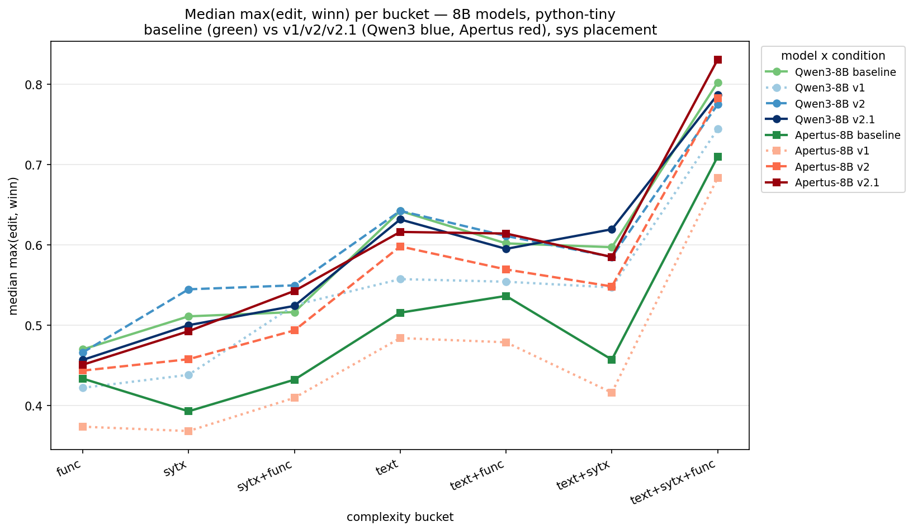
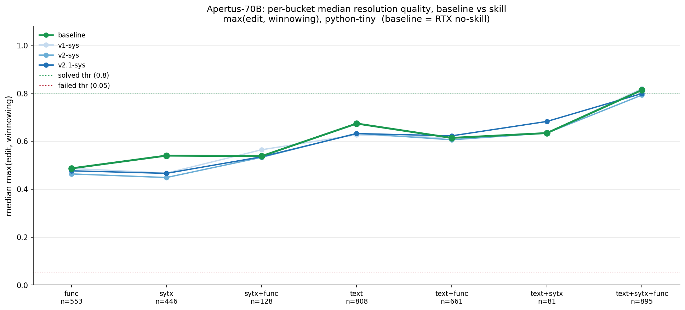
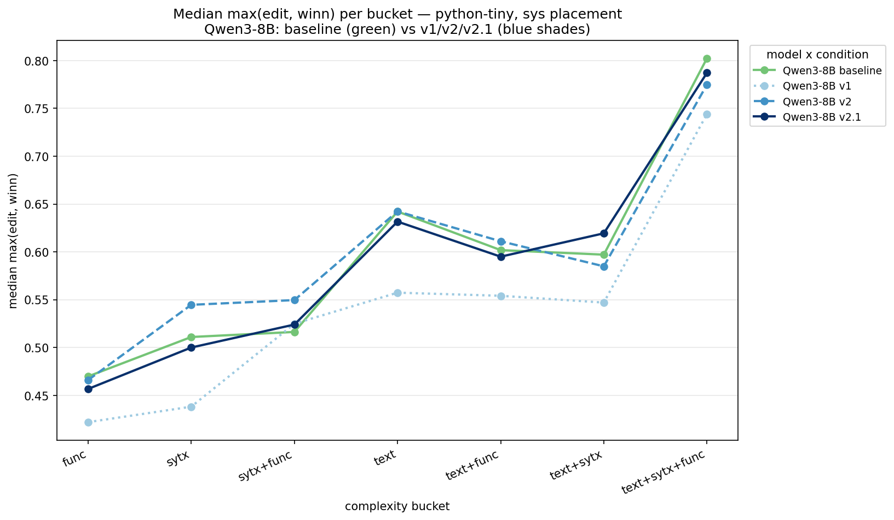
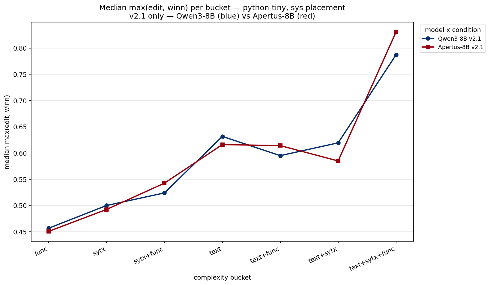
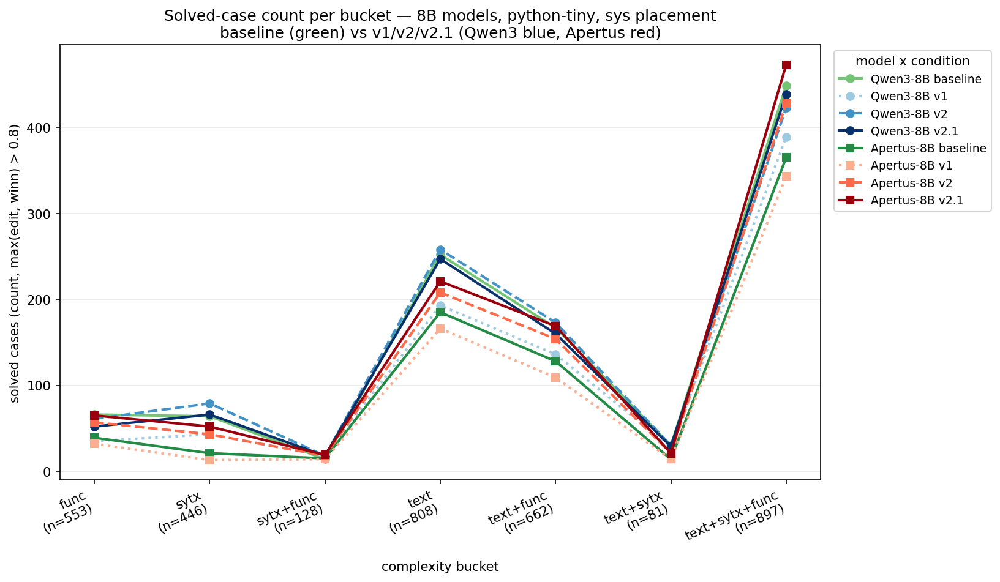
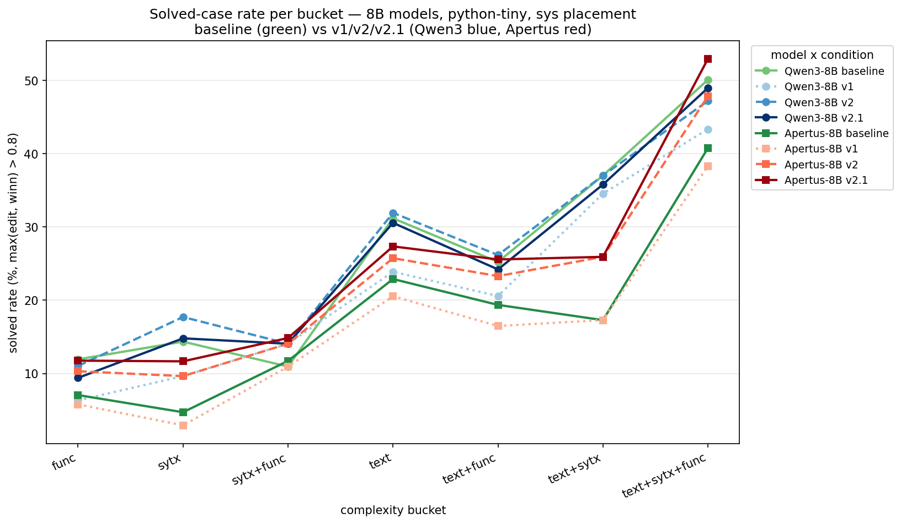

# Per-bucket skill effect: median vs solved-count/rate (8B, python-tiny)

Consolidates the per-bucket figures for the 8B pair (Qwen3-8B, Apertus-8B) across
the trajectory **baseline (no-skill) → v1 → v2 → v2.1** at **sys** placement, and
compares what the *median* view and the *solved-count / solved-rate* views each
tell us. Issues #77 (median charts), #78 (solved charts), #79 (this doc).

All metrics use `max(edit, winnowing)` per case, the same convention as the
baseline violins (#56/#67): error rows dropped, empty resolutions mapped to 0.
**solved** = `max(edit, winnowing) > 0.8`.

Data behind the figures: `docs/analysis/median_trends_max.csv`,
`docs/analysis/solved_counts.csv`. Scripts: `scripts/plot_median_trends.py`,
`scripts/plot_solved_rates.py`.

---

## 1. Median per bucket

Median of `max(edit, winnowing)` per complexity bucket. Qwen3-8B in blue shades,
Apertus-8B in red shades, baselines in green; line-style also encodes the version
(baseline solid, v1 dotted, v2 dashed, v2.1 solid).

**All eight series (both models, baseline + v1/v2/v2.1):**

**Per model** — Apertus shows a clean monotonic skill benefit (v2.1 on top in
every bucket); Qwen3 shows v1 *hurting* and v2/v2.1 hugging the baseline:

**v2.1 only, both models** — the two models track closely, with Apertus pulling
above Qwen3 at the hardest bucket `text+sytx+func` (the RQ3 crossover):

---

## 2. Solved cases per bucket — count and rate

**solved** = `max(edit, winnowing) > 0.8`. The **count** is the raw number of
solved cases per bucket (shaped by bucket size, shown as `n=…` on the x-axis);
the **rate** is `solved / n`, size-normalized.

The count chart's shape is dominated by *which buckets are biggest* (peaks at
`text` and `text+sytx+func`), regardless of skill. The rate chart removes that and
shows per-bucket *performance*.

---

## 3. How the median and solved views compare

Computed across all 56 cells (7 buckets × 2 models × 4 conditions).

### They tell the same story
- **Pearson r = 0.945, Spearman ρ = 0.923** between per-bucket median and
  per-bucket solved-rate. They move together almost in lockstep.
- The overall trajectories share the same shape:

  | model | view | baseline | v1 | v2 | v2.1 |
  |---|---|---|---|---|---|
  | Qwen3-8B | median | 0.607 | 0.540 | 0.600 | 0.589 |
  | Qwen3-8B | solved% | 29.2 | 23.6 | 29.2 | 28.3 |
  | Apertus-8B | median | 0.497 | 0.464 | 0.567 | 0.598 |
  | Apertus-8B | solved% | 21.5 | 19.3 | 26.0 | 28.6 |

  Qwen3 makes a V (v1 dips, v2 recovers, v2.1 slightly under) in both views;
  Apertus climbs monotonically after v1 in both; the **v2.1 crossover** (Apertus
  overtaking Qwen3) appears in both. The median and solved views are mutually
  reinforcing — they do not disagree on any conclusion.

### But they measure different parts of the distribution
- **Median** = the *centre* of the distribution (~0.5–0.6, which sits **well below**
  the 0.8 solved bar). It uses partial credit, moves smoothly, and is robust — it
  reports where the *typical* resolution lands.
- **Solved-rate** = mass in the *upper tail* (> 0.8 only). A hard threshold: it
  discards everything below 0.8 and is "blocky" (a 0.79 → 0.81 case flips solved
  status but barely nudges the median).
- **Count** = solved-rate × bucket size — adds volume weighting, so it is *not*
  comparable across buckets.

### Where they pull apart — the diagnostic value
The informative cells are where the two **disagree**, and it is systematic:
**`sytx+func`** has a respectable median (~0.52–0.55) but a low solved-rate
(~11–15%). The distribution there is **partial-heavy** — many half-right
resolutions clustered around 0.5, very few clean solves clearing 0.8. The median
looks fine; almost nothing actually gets *solved*.

Contrast **`text+sytx+func`**: high solved-rate (~50%) because it is **bimodal**
(many verbatim-pick cases near 1.0 plus many near 0), and that upper lump drags
the median up too.

### Takeaway
- Use the **median** to see how the *whole distribution* shifts — it catches
  partial-credit improvements a skill makes even when cases do not cross 0.8.
- Use the **solved-rate** to see whether resolutions reach usable quality (the bar
  that matters for the RQs).
- Use **counts** only for the absolute tally, not for cross-bucket comparison.

A skill that raises the median but not the solved-rate is making partials *better*
without making them *good enough* — `sytx+func` is exactly that case here.
