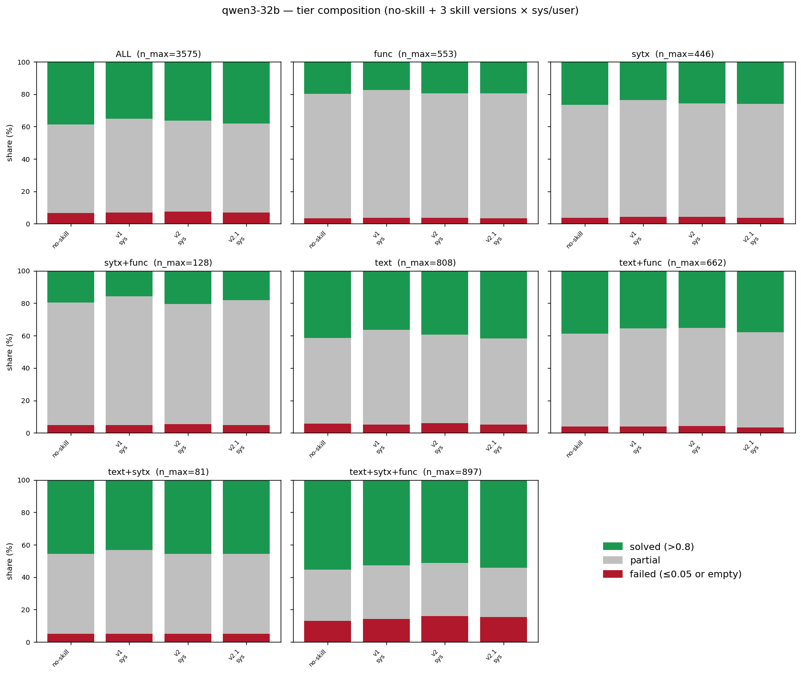
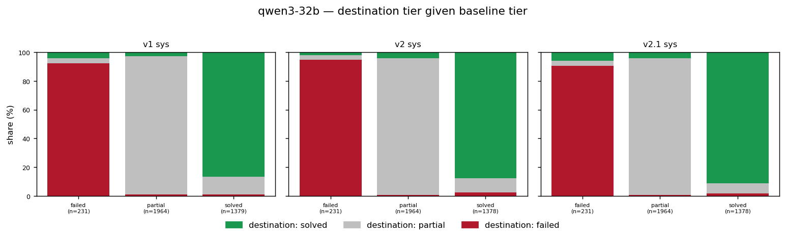
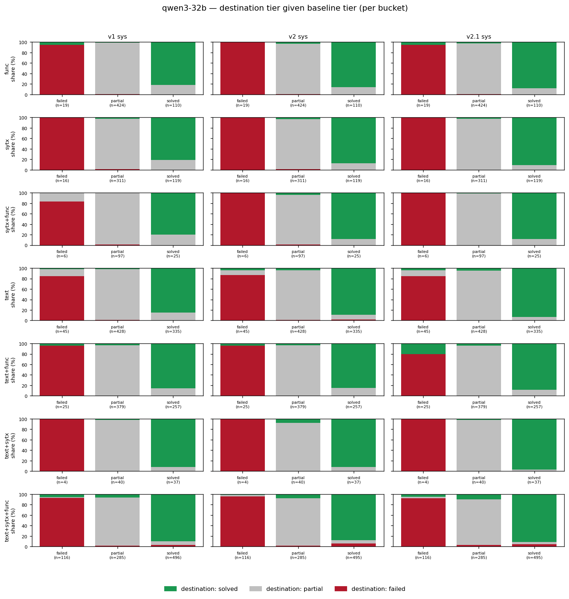

# Qwen3-32B performance analysis: no-skill / v1 / v2 / v2.1

Tier-level analysis of Qwen3-32B across the no-skill baseline plus v1 / v2 /
v2.1 (all `sys` placement — the large pair drops the `user` condition) on
the python-tiny ConGra slice. Part of #86.

Large-pair sibling of `docs/qwen3_performance_analysis.md` (8B, #62). The
analysis script `scripts/analyze_pass_fail.py` is reused with
`--model qwen3-32b --sys-only`. §6 is the cross-model (vs Apertus-70B) and
§7 the cross-scale (vs 8B) contrast.

## 1. Setup

**Inputs** (all in tree):

- `scripts/results/pilot_results_qwen3-32b_baseline_python_tiny_rtx.jsonl` (#87, #75)
- `scripts/results/qwen3-32b_v1_sysonly_clean.jsonl` (#75, #82)
- `scripts/results/qwen3-32b_v2_python_tiny_sysonly_RAW.jsonl` (#75)
- `scripts/results/qwen3-32b_v2.1_python_tiny_sysonly_RAW.jsonl` (#75)

**Tier scheme** unchanged from #56/#62: `solved` if `max(edit, winnowing) > 0.8`;
`failed` if `max(edit, winnowing) ≤ 0.05`; `partial` otherwise. Empty
resolutions fold in at score 0 → `failed`. Error rows excluded.

**Effective n per cell** (after excluding errors): no-skill 3,575; v1/v2/v2.1
sys 3,573–3,574 each. Paired n at ALL ≈ 3,573 (intersection of
baseline-scorable ∩ cell-scorable).

**Cross-environment confound — resolved (#87).** Earlier revisions of this
analysis read the skill runs (RTX 6000 box, #75) against a no-skill baseline
generated on UBELIX (#74), a different serve. #87 re-ran the no-skill baseline
on the **same RTX box** (`baseline_python_tiny_rtx`, c=16, `Qwen/Qwen3-32B`
bf16, `--max-model-len 32768`, temperature 0) and all numbers below now use it.
The RTX-vs-UBELIX drift is **negligible**: on the 3,557 common cases,
solved-rate +0.17pp (38.57% vs 38.40%), mean edit +0.0013, mean winnowing
+0.0012, **per-case tier agreement 99.7%** (3,546/3,557), mean |Δedit| 0.0028.
The confound was real but tiny — as expected for bf16 + temperature 0 — and the
comparison is now same-environment, so the caveat is dropped.

## 2. Overall composition

**Headline (ALL bucket, % of n):**

| condition | solved | partial | failed |
|---|--:|--:|--:|
| no-skill | 38.57% | 54.94% | 6.49% |
| v1 sys | 35.23% | 57.95% | 6.83% |
| v2 sys | 36.30% | 56.17% | 7.53% |
| v2.1 sys | **37.98%** | 55.19% | 6.83% |

- **All three skill versions are net-negative on solved-rate**, but the
  deficit shrinks monotonically: v1 −3.34pp → v2 −2.27pp → v2.1 **−0.59pp**.
- v2.1-sys is within noise of the baseline (−0.59pp solved, ALL Δedit
  −0.006). The skill on this strong baseline is effectively neutral by v2.1
  but never net-positive.
- Failed-rate barely moves (6.49% → 6.83–7.53%); the action is on the
  partial↔solved axis, not failure rescue.

## 3. Transitions vs the no-skill baseline

**Headline transitions (ALL bucket, baseline tier counts:
failed≈232, partial≈1,964, solved≈1,379):**

| cell | n_paired | partial→solved | solved→partial | net solved Δ |
|---|--:|--:|--:|--:|
| v1 sys | 3,574 | 54 | 171 | **−120** |
| v2 sys | 3,573 | 86 | 139 | **−81** |
| v2.1 sys | 3,573 | 87 | 100 | **−21** |

(`net solved Δ` = `partial→solved + failed→solved − solved→partial −
solved→failed`.)

- **Every version moves more cases down than up.** v1 is the worst
  (P→S 54 vs S→P 171, a 1:3.2 downward ratio). v2.1 nearly balances the
  flux (87:100, 1:1.1) — consistent with the −0.59pp ALL solved-rate.
- The monotonic v1→v2→v2.1 improvement in net flux (−120 → −81 → −21)
  mirrors the 8B Qwen3 trend and confirms #82: on a strong baseline, most of
  v1's deficit is a *skill-version* problem (output-discipline framing too
  blunt), not an intrinsic "skill always hurts" effect.
- Failure rescue is minimal: v2.1 pulls 8+14 = 22 of ~232 baseline-failed
  cases up (9.5%), but loses comparable ground elsewhere.

## 4. Per-bucket stratification (RQ2)

**Solved-rate per bucket** (% of bucket n; bold = improves over no-skill):

| bucket | n | no-skill | v1 sys | v2 sys | v2.1 sys |
|---|--:|--:|--:|--:|--:|
| func | 553 | 19.89 | 17.54 | 19.53 | 19.53 |
| sytx | 446 | 26.68 | 23.54 | 25.78 | 26.01 |
| sytx+func | 128 | 19.53 | 15.62 | **20.31** | 17.97 |
| text | 808 | 41.46 | 36.51 | 39.48 | **41.71** |
| text+func | 662 | 38.82 | 35.40 | 35.25 | 37.82 |
| text+sytx | 81 | 45.68 | 43.21 | 45.68 | 45.68 |
| text+sytx+func | 897 | 55.30 | 52.73 | 51.23 | 54.24 |

RQ2 read-out:

- **Almost no bucket is helped at any version.** The only cells above
  baseline are v2-sys `sytx+func` (+0.8pp, n=128, noise) and v2.1-sys `text`
  (+0.3pp). Every other cell is flat or negative.
- The damage is largest on text-heavy buckets at v1 (`text` −5.0pp,
  `text+func` −3.4pp), and v2.1 recovers most of it (`text` back to +0.3pp).
- The hardest bucket `text+sytx+func` (baseline 55.30%, the highest solved
  baseline) is consistently dented: v2 −4.1pp, v2.1 −1.1pp. On a strong
  baseline the skill has nothing to add and a little to subtract.

## 5. Baseline-normalised Δedit summary

**Mean Δedit per bucket** (Δ = skill − no-skill; positive = skill helps):

| bucket | v1 sys | v2 sys | v2.1 sys |
|---|--:|--:|--:|
| func | −0.024 | −0.004 | −0.001 |
| sytx | −0.048 | −0.003 | −0.009 |
| sytx+func | −0.011 | −0.010 | −0.000 |
| text | −0.032 | −0.028 | −0.011 |
| text+func | −0.022 | −0.014 | **+0.004** |
| text+sytx | −0.048 | −0.008 | −0.026 |
| text+sytx+func | −0.017 | −0.032 | −0.007 |
| **ALL** | **−0.027** | **−0.019** | **−0.006** |

- **ALL Δedit climbs monotonically toward zero**: −0.027 → −0.019 → −0.006.
  By v2.1 the per-token edit effect is at parity (within noise).
- Only one positive bucket cell in the entire matrix (v2.1 `text+func`
  +0.004). The skill never *adds* edit-quality on this baseline; the best it
  achieves is doing no harm.
- This reproduces the 8B Qwen3 monotonicity and the #82 confound resolution
  at full per-bucket resolution: the v1 deficit is largely a skill-version
  artefact, removed by v2.1's refined output discipline.

## 6. Cross-model contrast (vs Apertus-70B)

Within the large pair, **both models are harmed by the skill** — a sharp
departure from the 8B pair, where Apertus-8B was helped. See
`docs/apertus_70b_performance_analysis.md` for the Apertus side.

**ALL-bucket solved-rate Δ vs each model's own baseline (sys placement):**

| condition | Qwen3-32B (base 38.57%) | Apertus-70B (base 31.52%) |
|---|--:|--:|
| v1 sys | −3.34 | −1.37 |
| v2 sys | −2.27 | −3.71 |
| v2.1 sys | **−0.59** | −2.70 |

- **Qwen3-32B recovers monotonically (v1→v2→v2.1 → near zero); Apertus-70B
  does not** (v2 is its worst version). The clean v1→v2→v2.1 design-iteration
  story holds only on Qwen3-32B at this scale.
- **ALL Δedit:** Qwen3-32B −0.027 / −0.019 / −0.006 vs Apertus-70B
  −0.011 / −0.032 / −0.022. Both negative throughout; Qwen3-32B converges to
  zero, Apertus-70B stays meaningfully negative.
- The 8B-pair finding ("Apertus is helped, Qwen3 is not") does **not**
  reproduce at the large scale. At 32B/70B the verdict is uniform: the skill
  is neutral-to-harmful for both. See §7 for why this is consistent with the
  baseline-capability mechanism rather than a contradiction of it.

## 7. Cross-scale contrast (vs the 8B pair) — absolute-capability framing

**Solved-rate Δ vs own baseline, all four models, sys placement:**

| model | baseline solved% | v1-sys | v2-sys | v2.1-sys |
|---|--:|--:|--:|--:|
| Apertus-8B | 21.47% | −2.13 | +4.55 | **+7.10** |
| Qwen3-8B | 29.16% | −5.60 | +0.00 | −0.86 |
| Apertus-70B | 31.52% | −1.37 | −3.71 | −2.70 |
| Qwen3-32B | 38.57% | −3.34 | −2.27 | −0.59 |

Read top-to-bottom in increasing baseline strength:

- **The only model that the skill clearly helps is the weakest baseline
  (Apertus-8B, 21.47% solved).** Every model at or above ~29% solved is
  neutral-to-harmed by every skill version.
- **The discriminating variable is absolute baseline capability, not model
  family or parameter count.** Apertus-70B (31.52%) behaves like Qwen3, not
  like its own 8B sibling: once Apertus is scaled up past the ~29–30% solved
  threshold, the skill stops helping and starts hurting. The "skill direction
  = baseline strength" finding from the 8B pair (#62/#66) is therefore better
  stated as: *the skill's benefit is a function of how weak the underlying
  model is in absolute terms; it disappears and reverses once the model is
  already competent on the task.*
- For Qwen3-32B specifically, v2.1-sys reaches −0.59pp solved / −0.006 Δedit
  — effectively neutral, the same "strong baseline → skill ≈ no-op" pattern
  Qwen3-8B showed, now confirmed at 4× the parameters.

## 8. Implications for RQs

- **RQ1 (does the skill improve resolution quality?)** — **No on
  Qwen3-32B.** Every version is net-negative, though v2.1-sys is within noise
  of zero (−0.59pp solved, −0.006 Δedit). The skill does not improve a strong
  baseline; at best it does no harm.
- **RQ2 (does effect vary by complexity?)** — Weakly. The per-bucket pattern
  is "uniformly flat-to-negative", with v1's text-bucket damage being the
  most complexity-dependent feature and v2.1 erasing most of it. No bucket
  shows a robust positive skill effect.
- **RQ3 (small/weak + skill vs large/strong no-skill)** — addressed by the
  cross-scale and gap-closure figures (#86); see the RQ3 violins. The
  headline cross-scale table in §7 shows the skill's gap-closing power is
  confined to the weakest baseline.
- **Cross-scale headline:** the positive RQ1 result is a small-model
  phenomenon, governed by absolute baseline capability (§7).

## 9. Pointers

- Script: `scripts/analyze_pass_fail.py --model qwen3-32b --sys-only`.
- CSVs: `docs/analysis/qwen3-32b_{tier_counts,transitions,delta_edit}.csv`.
- Figures: `docs/figures/qwen3-32b_{tier_stacked,transitions,transitions_per_bucket}.png`.
- Apertus-70B sibling: `docs/apertus_70b_performance_analysis.md`.
- 8B siblings: `docs/qwen3_performance_analysis.md` (#62),
  `docs/apertus_performance_analysis.md` (#66).
- Confound origin: #82 (32B v2.1-sys confound check), #74 (UBELIX baseline);
  resolved same-environment by #87 (RTX-box no-skill baseline; drift
  negligible, see §1).
