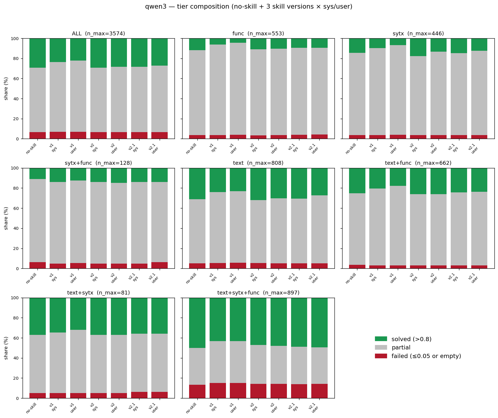
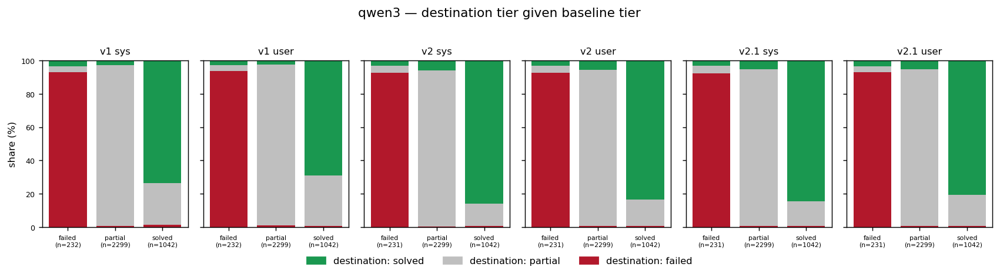
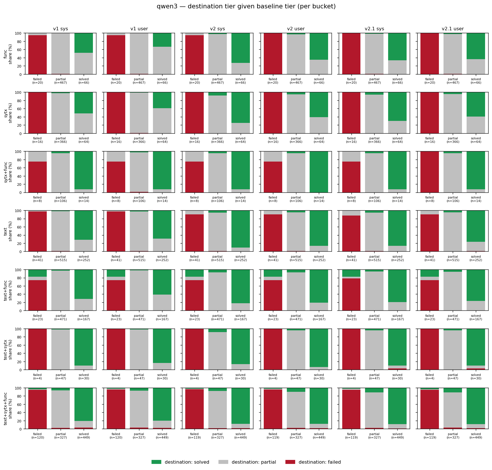

# Qwen3-8B performance analysis: no-skill / v1 / v2 / v2.1

Tier-level analysis of Qwen3-8B across the 4 skill conditions (no-skill
baseline plus v1 / v2 / v2.1 each in `sys` and `user` placements) on the
python-tiny ConGra slice. Closes #62.

A sibling Apertus issue will mirror this once filed; the analysis script
(`scripts/analyze_pass_fail.py`) is parameterised by `--model` and four
input paths.

## 1. Setup

**Inputs** (all in tree):

- `scripts/results/pilot_results_qwen3_baseline_python_tiny.jsonl` (#46)
- `scripts/results/pilot_results_qwen3_v1_python_tiny.jsonl` (#63, #53)
- `scripts/results/pilot_results_qwen3_v2_python_tiny.jsonl` (#54)
- `scripts/results/pilot_results_qwen3_v2.1_python_tiny.jsonl` (#55)

**Tier scheme** (locked in #56): `solved` if
`max(edit, winnowing) > 0.8` (ConGra paper convention, Zhang et al. 2024);
`failed` if `max(edit, winnowing) ≤ 0.05` (data-cliff anchor); `partial`
otherwise. Empty resolutions fold in at score 0 → `failed`. Error rows
(`error != None`, HTTP 400 max-context) are excluded.

**Effective n per cell** (after excluding errors; empties retained as
score 0):

| cell | n |
|---|---|
| no-skill | 3,574 |
| v1 sys / user | 3,573 each |
| v2 sys / user | 3,572 each |
| v2.1 sys / user | 3,572 each |

The 23 cases v1 dropped via `--max-prompt-tokens 30720` pre-filter (#60)
overlap with the 23 baseline HTTP-400 cases; v2 and v2.1 add 1 additional
context-length exclusion each. All transition counts in §3 are reported
over the intersection with the baseline-scorable set (the `n_paired`
column of `qwen3_transitions.csv`).

## 2. Overall composition

**Headline (ALL bucket, % of n):**

| condition | solved | partial | failed |
|---|--:|--:|--:|
| no-skill | **29.16%** | 64.33% | 6.52% |
| v1 sys | 23.56% | 69.59% | 6.86% |
| v1 user | 22.05% | 70.98% | 6.97% |
| v2 sys | 29.16% | 64.32% | 6.52% |
| v2 user | 28.32% | 65.10% | 6.58% |
| v2.1 sys | 28.30% | 65.10% | 6.61% |
| v2.1 user | 27.23% | 66.05% | 6.72% |

- **v1 regresses sharply** in both placements: −5.6pp (sys) and −7.1pp
  (user) on solved rate. Failed rate barely moves (+0.3pp), so the loss
  is entirely partial-bound: cases that were solved at baseline drift
  into the partial middle.
- **v2-sys recovers exactly to baseline** at the headline level (29.16%
  solved, identical to two decimals). v2-user is 0.8pp below.
- **v2.1 underperforms v2** in both placements by 0.9–1.1pp. This is
  the same direction predicted by the n=20 `python/func` pilot (Qwen3-sys
  v2 −0.012 → v2.1 −0.037 mean Δedit) but with smaller magnitude at
  full python-tiny n.

Failed rate is stable within ±0.5pp across all 7 conditions. The skill
versions move cases between `solved` and `partial`, not into or out of
`failed`.

## 3. Transitions vs the no-skill baseline

Source-stratified stacked bars: for each skill condition, three bars
(baseline tier = failed / partial / solved), each stacked into the
destination distribution under the skill.

**Headline transitions (ALL bucket, baseline tier counts:
failed=233, partial=2,299, solved=1,042):**

| cell | n_paired | partial→solved | solved→partial | net solved Δ |
|---|--:|--:|--:|--:|
| v1 sys | 3,573 | 65 | 261 | **−196** |
| v1 user | 3,573 | 61 | 314 | **−253** |
| v2 sys | 3,572 | 140 | 141 | **−1** |
| v2 user | 3,572 | 133 | 164 | −31 |
| v2.1 sys | 3,572 | 124 | 156 | −32 |
| v2.1 user | 3,572 | 124 | 193 | −69 |

(`net solved Δ` = `partial→solved + failed→solved − solved→partial −
solved→failed`; the small failed↔solved flows are below.)

Three observations:

1. **v2-sys is in flux equilibrium.** The skill moves 140 cases up from
   partial to solved while moving 141 cases down — almost exactly
   conservative. Mean Δedit at ALL is −0.0038, the smallest magnitude
   of any cell. This is not "no effect on individual cases" but "the
   gains and losses cancel at the aggregate."
2. **v1 is highly asymmetric.** ~4–5× more solved→partial drops than
   partial→solved lifts in both placements. The skill is doing harm
   more often than help, and the structure of v1 (the minimal SKILL.md
   prototype) does not survive the python-tiny scale.
3. **v2.1 trades 16 v2 partial→solved lifts for 15 more solved→partial
   drops** (sys: 124 vs 140 lifts; 156 vs 141 drops). v2.1's stronger
   output-discipline framing applies the skill harder on solved-baseline
   cases that didn't need it — consistent with the mechanism hypothesis
   in `docs/pilot_results_v2_1.md` ("v2.1 is more skill applied harder;
   on a model that doesn't need much, more skill = more harm").

**Failure rescue is rare.** failed→solved is 7–8 of 233 baseline-failed
cases for every condition (≈3%). failed→failed is 213–217 (≈92–93%) in
every condition. Whatever the skill is doing, it does not rescue
deep-fail cases. The skill operates on partial-tier and solved-tier
cases.

## 4. Per-bucket stratification (RQ2)

**Solved-rate per (skill, condition) per bucket** (% of bucket n; bold
= improves over no-skill baseline):

| bucket | n | no-skill | v1 sys | v1 user | v2 sys | v2 user | v2.1 sys | v2.1 user |
|---|--:|--:|--:|--:|--:|--:|--:|--:|
| func | 553 | 11.93 | 6.33 | 4.52 | 11.03 | 10.49 | 9.40 | 9.40 |
| sytx | 446 | 14.35 | 9.64 | 6.73 | **17.71** | 13.23 | **14.80** | 12.56 |
| sytx+func | 128 | 10.94 | **14.06** | **12.50** | **14.06** | **14.84** | **14.06** | **14.06** |
| text | 820 | 31.19 | 23.89 | 23.14 | **31.93** | 30.07 | 30.57 | 27.10 |
| text+func | 663 | 25.23 | 20.57 | 17.70 | **26.17** | **26.02** | 24.21 | 23.75 |
| text+sytx | 81 | 37.04 | 34.57 | 32.10 | 37.04 | 37.04 | 35.80 | 35.80 |
| text+sytx+func | 906 | 50.11 | 43.37 | 43.14 | 47.21 | 48.10 | 49.00 | 49.33 |

(bucket-n here is bucket-cases ∩ no-skill-scorable; the per-cell n_paired
in the transition CSV differs by ±1 case where v2 / v2.1 hit
context-length on a different case than the baseline did.)

Pattern (RQ2 read-out):

- **`sytx+func` (n=128) is the only bucket where every skill improves**
  over baseline, in both placements. Baseline is 10.94% solved; v1-sys
  is 14.06% (+3.1pp); v2-user is 14.84% (+3.9pp). This is the smallest
  bucket and the only one where the baseline is mostly partial cases
  (the 14 baseline-solved cases all stay solved under v1; per-bucket
  transition figure row 3).
- **`sytx` (n=446) responds positively to v2-sys (+3.4pp) and v2.1-sys
  (+0.5pp)**, but every user-placement and v1 condition hurts. The skill
  helps when delivered in the system role on a syntax-only bucket.
- **`func` (n=553) is hurt or flat by every condition.** v2-sys is the
  closest (−0.9pp); v1 cuts the solved rate roughly in half (11.93% →
  4.5–6.3%).
- **`text+sytx+func` (n=906) — the largest bucket and the most polarised
  (50% solved + 14% failed in baseline) — is hurt by every condition**
  by −0.8pp to −7.0pp. The biggest absolute loss in the matrix
  (v1-sys: −6.7pp; v1-user: −7.0pp).
- **v2 and v2.1 diverge from v1 most on text-containing buckets.** v1
  loses 5–8pp of solved-rate on `text`, `text+func`, `text+sytx+func`;
  v2/v2.1 mostly hold within 1pp.

The bucket-level reads strengthen the §3 finding: skills do not rescue
failures; they redistribute between solved and partial, and the direction
depends on the bucket. `sytx+func` is consistently helped; everything
else is at-best break-even.

## 5. Baseline-normalised Δedit summary

![Source data: docs/analysis/qwen3_delta_edit.csv]

**Mean Δedit per (skill, condition, bucket)** (Δ = skill − no-skill,
positive = skill helps; n_paired ≈ 3,572 at ALL):

| bucket | v1 sys | v1 user | v2 sys | v2 user | v2.1 sys | v2.1 user |
|---|--:|--:|--:|--:|--:|--:|
| func | −0.044 | −0.057 | +0.006 | +0.000 | −0.007 | −0.013 |
| sytx | −0.049 | −0.077 | **+0.015** | −0.017 | −0.005 | −0.028 |
| sytx+func | **+0.020** | **+0.009** | **+0.022** | **+0.021** | **+0.006** | **+0.009** |
| text | −0.060 | −0.061 | +0.000 | −0.012 | −0.011 | −0.027 |
| text+func | −0.039 | −0.060 | +0.001 | +0.001 | −0.007 | −0.012 |
| text+sytx | −0.059 | −0.076 | −0.021 | −0.022 | −0.017 | −0.026 |
| text+sytx+func | −0.053 | −0.058 | −0.029 | −0.019 | −0.017 | −0.017 |
| **ALL** | **−0.048** | **−0.059** | **−0.004** | **−0.009** | **−0.010** | **−0.018** |

Three takeaways consistent with §2 and §4:

- **v1 mean Δedit is uniformly negative** except on `sytx+func` (where
  the n=128 makes the +0.020 sys / +0.009 user lift one of the few
  bucket-level wins for v1).
- **v2-sys is the only column with multiple positive bucket entries.**
  `sytx` (+0.015), `sytx+func` (+0.022), `func` (+0.006), `text+func`
  (+0.001), `text` (0.000); negative on `text+sytx` (−0.021) and
  `text+sytx+func` (−0.029). ALL is −0.004 — bucket-level positives are
  outweighed at the aggregate by the two `text+sytx*` buckets.
- **v2.1 attenuates v2's gains.** Every bucket where v2-sys is positive,
  v2.1-sys is smaller-positive or negative. v2.1's stronger output
  discipline is taking from the bucket gains, not protecting against
  the bucket losses.

## 6. Implications for RQs

- **RQ1 ("does the skill improve resolution quality?")** — at full
  python-tiny n=3,572: **no, on Qwen3.** v1 hurts; v2 is at flux
  equilibrium and net flat; v2.1 is a small regression vs v2. The skill
  treats solved-tier cases destructively roughly as often as it lifts
  partial-tier cases. There is no headline aggregate gain over baseline
  in any condition.
- **RQ2 ("does effect vary by complexity?")** — yes, sharply.
  `sytx+func` is helped by every skill; `sytx` is helped by v2-sys and
  v2.1-sys (system role only); other buckets are net hurt or flat. The
  bucket where there is a tier-distribution win does not coincide with
  the largest bucket (`text+sytx+func`, the polarised one), so the
  weighted-average effect at ALL is dominated by the harder text-heavy
  buckets.
- **#43 keep/iterate v2.1 decision** — the deferred per-case Δ
  comparison (`docs/pilot_results_v2_1.md` §"Decision pending") is now
  answerable at full n. v2.1 trades 16 partial→solved v2 lifts for 15
  more solved→partial drops (§3 table). The net is a
  −1pp solved-rate change at ALL (29.16% v2 → 28.30% v2.1 sys; 28.32%
  v2 → 27.23% v2.1 user). v2.1 is not a v2 improvement on Qwen3 at
  python-tiny scale.

## 7. Pointers

- Script: `scripts/analyze_pass_fail.py` — parameterised by `--model`,
  `--baseline`, `--v1`, `--v2`, `--v2.1`, and output dirs. Apertus
  sibling will reuse it verbatim.
- CSVs: `docs/analysis/qwen3_{tier_counts,transitions,delta_edit}.csv`.
- Figures: `docs/figures/qwen3_{tier_stacked,transitions,transitions_per_bucket}.png`.
- Tier framework source: `docs/baseline_pass_fail_analysis.md` (#56).
